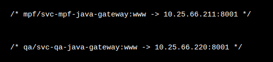

# Kube Proxy

- Take me to [Video Tutorial](https://kodekloud.com/topic/kube-proxy/)

In this section, we will take a look at kube-proxy.

Within Kubernetes Cluster, every pod can reach every other pod by using the IP of the pod but there is no guarantee that the IP remains same. Hence, a better way for Web App (Pod 1) to access Database (Pod 2) is by using a Service. So, we create a database service (db) to expose the database application across the cluster.

The Web App can now access the Database using Service name **db** or its IP.

The Service also get assigned an IP address. So whenever a Pod tries to reach the service using its name or IP, It forwards the traffic to backend Pod, Database pod in this case.

**But what is this Service and how does it get an IP? Does the Service join the same pod network?**

The Service cannot join the pod network as it is not an actual thing. It is a virtual component that lives in kubernetes memory. But then we said, the Service should be accessible accross the cluster from any Nodes.
So that how is that achieved?

Thats where Kube Proxy comes into the picture.

Kube-Proxy is a process that runs on each node in the kubernetes cluster.
It's job is to look for new services, and everytime a new service is created,
**It creates an appropriate rule in each node to forward traffic to those Services to the backend pods.**


- 

We can see the Ip rules using the below command:

```
sudo iptables -L -t nat
```

- 

## Install kube-proxy - Manual

- Download the kube-proxy binary from the kubernetes release pages [kube-proxy](https://storage.googleapis.com/kubernetes-release/release/v1.13.0/bin/linux/amd64/kube-proxy). For example: To download kube-proxy v1.13.0, Run the below command.

  ```
  $ wget https://storage.googleapis.com/kubernetes-release/release/v1.13.0/bin/linux/amd64/kube-proxy
  ```
- Extract it
- Run it as a service

  

## View kube-proxy options - kubeadm

- If you set it up with kubeadm tool, kubeadm tool will deploy the kube-proxy as pod in kube-system namespace. In fact it is deployed as a daemonset on master node.

  ```
  $ kubectl get pods -n kube-system
  ```

  

K8s Reference Docs:

- https://kubernetes.io/docs/reference/command-line-tools-reference/kube-proxy/
- https://kubernetes.io/docs/concepts/overview/components/
