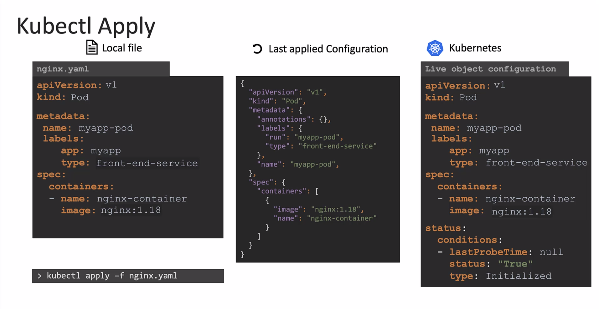

# Kubectl Command

In this lecture, we'll understand more about how the kubectl apply command works.

- The apply command takes into consideration the **`local configuration file`**, the **`live object definition on Kubernetes`**, and the **`last applied configuration`** before making a decision on what changes are to be made.

- For example, say when the nginx image is updated to 1.19 in our local file and we run the kubectl apply command, this value is compared with the value in the live configuration.
  And if there is a difference, the live configuration is updated with the new value. After any change, the last applied json format is always updated to the latest so that it's always up to date.

