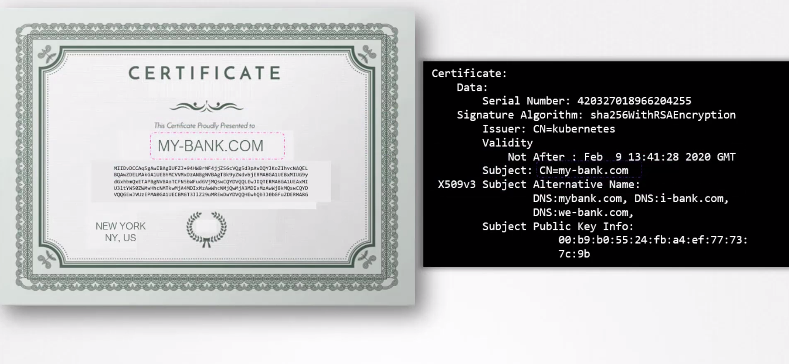

# TLS Basics

- Take me to [Video Tutorial](https://kodekloud.com/topic/tls-basics/)

In this section, we will take a look at TLS Basics

## Certificate

- A certificate is used to guarantee trust between 2 parties during a transaction.
- Example: when a user tries to access web server, TLS certificates ensure that the communication between them is encrypted and the server is who it says it is.
  
  

## Let's take a look at a scenario

- Without secure connectivity, if a user were to access his online banking application, the credentials he types in would be sent in a plain text format. The hacker sniffing network traffic could easily retrieve the credentials and use it to hack into the user's bank account. Well, that's obviously not safe.
  
  
- So you must encrypt the data being transferred using encryption keys.

## Symmetric Encryption

- The data is encrypted using a key, which is basically a set of random numbers and alphabets.
  
- The data is then sent to the server. The hacker sniffing the network gets the data, but can't do anything with it.
- However, the same is the case with the server receiving the data. It cannot decrypt the data without the key.
- So a copy of the key must also be sent to the server so that the server can decrypt and read the message. But since the key is also sent over the same network, the attacker can sniff that as well and decrypt the data with it.
  
  
- This is known as **`Symmetric Encryption`.** It is a secure way of encryption, but it uses the same key to encrypt and decrypt the data and the key has to be exchanged between the sender and the receiver, there is a risk of a hacker gaining access to the key and decrypting the data.

## Asymmetric Encryption

- Instead of using single key to encrypt and decrypt data, asymmetric encryption uses a pair of keys, a **`private key`** and a **`public key`** (say **`public lock`** for the sake of simplicity)
- A key, which is only with me, so it's private and a lock that anyone can access, so it's public.
  
  
- If you encrypt or lock the data with your lock, you can only open it with the associated private key. So your private key must always be secure with you and not be shared with anyone else, it's private, but the lock is public and maybe shared with others, but they can only lock something with it.
  
  
  
  ---
  
  Before we go back to our web server example, let's look at an even simpler use case of securing SSH access to servers using key pairs.
  
  - You have a server in your environment that you need access to and you don't want to use passwords as they're too risky so you decide to use key pairs.
  - You generate a public and private key pair by running the ssh-keygen command. It creates two files, ID_RSA is the private key and ID_RSA.pub is the public key. Well, not a public key, a public lock.
  - You then secure your server by locking down all access to it using public lock. It's usually done by adding an entry of your public key into the server's SSH authorized_keys file.
    
    
  - If you want to SSH, you specify the location of your private key in your SSH command.
  - What if you have other servers in your environment? How do you secure more than one server with your key pair?
  - Well, you can create copies of your public lock and place them on as many servers as you want. You can use the same private key to SSH into all of your servers securely.
    
    
  - But what if other users need access to your servers?
  - Well, they can do the same thing. They can generate their own public and private key pairs. As the only person who has access to those servers, you can create an additional door for them and lock it with their public locks, copy their public locks to all the servers, and now other users can access the servers using their private keys.
    
    

---

- Let's go back to our web server example.
- The problem we had earlier with symmetric encryption was that the key used to encrypt data has to be sent to the server over the network along with the encrypted data, and so there is a risk of the hacker getting the key to decrypt the data.
  **`What if we could somehow get the key to the server safely?`**
- To securely transfer the symmetric key from the client to the server, we use **`Asymmetric encryption.`**
- So we generate a public and private key pair on the server. The SSH keygen command that was used earlier to create a pair of keys, was for SSH purposes. Here we use the open SSL command to generate a private and public key pair.
  
  
- `When the user first accesses the web server using HTTPS, he gets the public key from the server`. Since the hacker is sniffing all traffic, let us assume he too gets a copy of the public key.
  
- The user, in fact, the user's browser then encrypts the symmetric key using the public key provided by the server and the symmetric key is now secure.
  
- The user then sends this to the server. The hacker also gets a copy. The server uses the private key to decrypt the message and retrieve the symmetry key from it. However, the hacker does not have the private key to decrypt and retrieve the symmetric key from the message. The hacker only has the public key with which he can only lock or encrypt a message and not decrypt the message. Hence, the symmetric key is now safely available only to the user and the server.
  
- The receiver can use the same symmetric key to decrypt data and retrieve information. The hacker is left with the encrypted messages and public keys with which he can't decrypt any data. With **`asymmetric encryption`**, we have successfully transferred the symmetric keys from the user to the server, and with **`symmetric encryption`** we have secured all future communication between them.
  
  

---

- The hacker now looks for new ways to hack into your account, and so he realizes that the only way he can get your credential is by getting you to type it into a form he presents. So he creates a website that looks exactly like your bank's website. The design is the same, the graphics are the same, the website is a replica of the actual bank's website. He hosts the website on his own server. He wants you to think it's secure too, so he generates his own set of public and private key pairs and configures them on his web server. And finally, he somehow manages to tweak your environment or your network to route your request going to your bank's website to his servers.
- You typed in HTTPS in the URL to make sure the communication is secure and encrypted. Your browser receives a key, you send encrypted symmetric key and then you send your credentials encrypted with the key and the receiver decrypts the credentials with the same symmetric key. You've been communicating securely in an encrypted manner, but with the hacker's server.
  
  
  

---

What if you could look at the public key you received from the server and say if it is a legitimate key from the actual bank server?

- When the server sends the key, it does not send the key along, it sends a **`Certificate`** that has the key in it.
- It has other information like who the certificate is issued to, the public key of that server, the location of that server etc.
  

#### How do you look at a certificate and verify if it is legit?

- who signed and issued the certificate.
- If you generate the certificate then you will have it sign it by yourself; that is known as self-signed certificate.
- If you looked at the certificate you received from the hacker closely, you would've noticed that it was a fake certificate that was signed by the hacker himself. As a matter of fact, your browser does that for you. `All of the web browsers are built in with a certificate validation mechanism` that checks the certificate received from the server and validates it to make sure it is legitimate. If it identifies it to be a fake certificate, then it actually warns you.
  

#### How do you generate legitimate certificate? How do you get your certificates singed by someone with authority?

- That's where **`Certificate Authority (CA)`** comes in for you. Some of the popular ones are Symantec, DigiCert, Comodo, GlobalSign etc.
- The way this works is, you generate a certificate signing a request or CSR using the key you generated earlier and the domain name of your website. You can do this using the open SSL command.
  
  
- This generates a my-bank.csr file, which is the certificate signing request that should be sent to the CA for signing. The certificate authorities then verify your details and once it checks out, they sign the certificate and send it back to you. You now have a certificate signed by a CA that the browsers trust.
- If the hacker tries to get his certificate signed the same way, he would fail during the validation phase and his certificate would be rejected by the CA. So the website that he's hosting won't have a valid certificate.
  
  
  
- But how do the browsers know that the CA itself was legitimate?
  For example: How would the browser know Symantec is a valid CA and that the certificate was in fact signed by Symantec and not by someone who says they are Symantec?
- The CAs themselves have a set of public and private key pairs. The CAs use their private keys to sign the certificates. The public keys of all the CAs are built in to the browsers.
  
  
- The browser uses the public key of the CA to validate that the certificate was actually signed by the CA themselves. You can actually see them in the settings of your web browser under certificates, they're under trusted CAs tab.

  
- However, for private sites within your organizations (e.g., payroll or internal email applications), organizations can host their own private CAs.
- Many companies offer private CA server solutions for internal use, allowing organizations to establish secure connectivity within their network.
- By installing the public key of the internal CA server on employees&#39; browsers, organizations can ensure secure communication within their organization.

## Certificates naming convention

