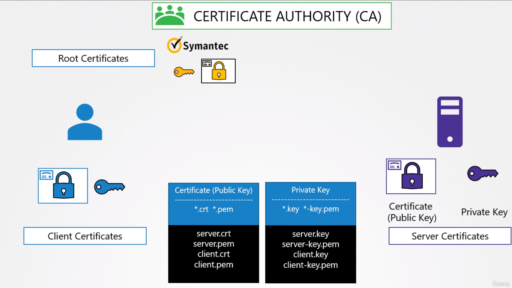
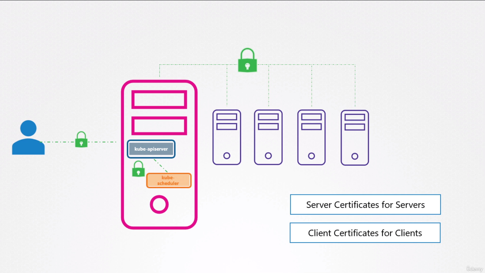
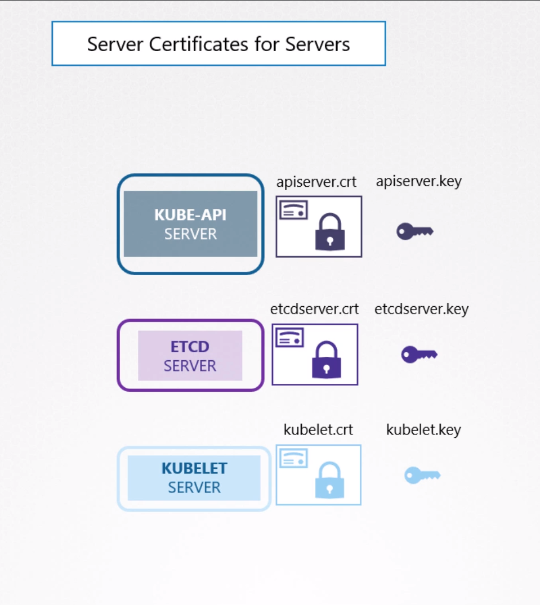
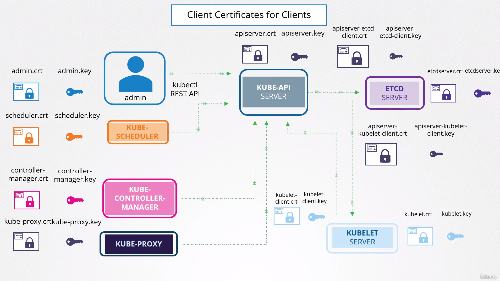

# TLS in Kubernetes

- Take me to [Video Tutorial](https://kodekloud.com/topic/tls-in-kubernetes/)

In this section, we will take a look at TLS in kubernetes

- In the previous lecture we learned what public and private keys are.
- How a server uses public and private keys to secure connectivity. We will call them server certificates.
- We saw what a Certificate Authority is. We learned that the CA has its own set of public and private keepers that it uses to sign server certificates. We will call them root certificates.
- We also saw how a server can request a client to verify themselves using client certificates.
- So, there are three types of certificates:
  
  - **`Server certificates`** configured on the servers,
  - **`Root certificate`** configured on the CA servers,
  - **`Client certificates`** configured on the clients.
  
  
- We will now see how these concepts relate to a Kubernetes cluster. The Kubernetes cluster consists of a set of master and worker nodes. Of course, all communication between these nodes need to be secure and must be encrypted. All interactions between all services and their clients need to be secure too.
  
  
  
  1. As we know already, the kube API server exposes an HTTPS service that other components, as well as external users, use to manage the Kubernetes cluster. So it is a server and it requires certificates to secure all communication with its clients.
  2. The etcd server stores all information about the cluster. So it requires a pair of certificate and key for itself.
  3. The kubelet also exposes an HTTPS API endpoint that the kube-apiserver use to interact with the worker nodes. Again, that requires a certificate and key pair.
     
     
  4. The clients who access the kube-apiserver are us, the administrators through kubectl REST API. The admin user requires a certificate and key pair to authenticate to the kube-API server.
  5. The scheduler talks to the kube-apiserver to look for pods that require scheduling and then get the API server to schedule the pods on the right worker nodes. The scheduler is a client that accesses the kube-apiserver. So, the scheduler is just another client, like the admin user. Hence, the scheduler needs to validate its identity using a client TLS certificate. So it needs its own pair of certificate and keys.
  6. The Kube Controller Manager is another client that accesses the kube-apiserver, so it also requires a certificate for authentication to the kube-apiserver.
  7. Same with the kube-proxy, it requires a client certificate to authenticate to the kube-apiserver, and so it requires its own pair of certificate and keys.
     
- So that's too many certificates. Let's try and group them.
  

