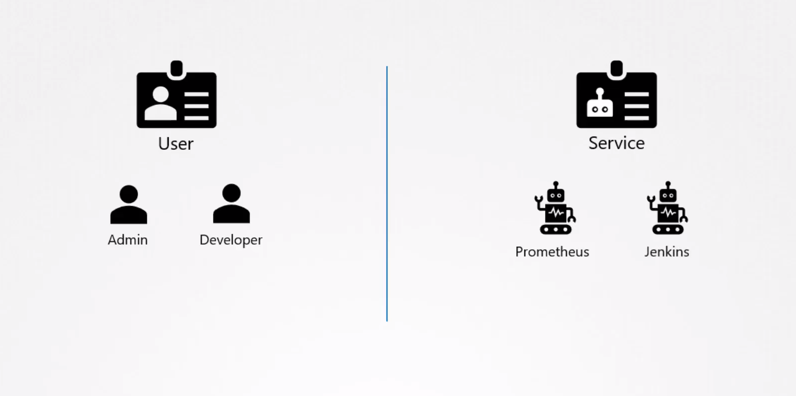
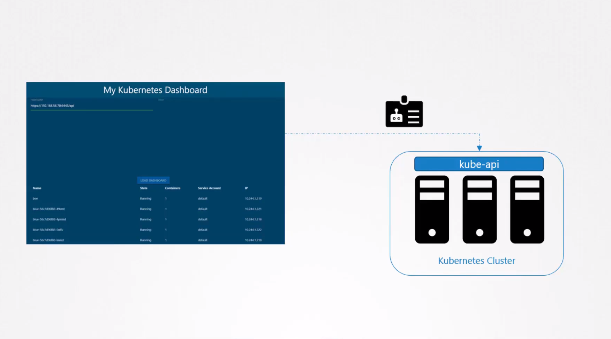
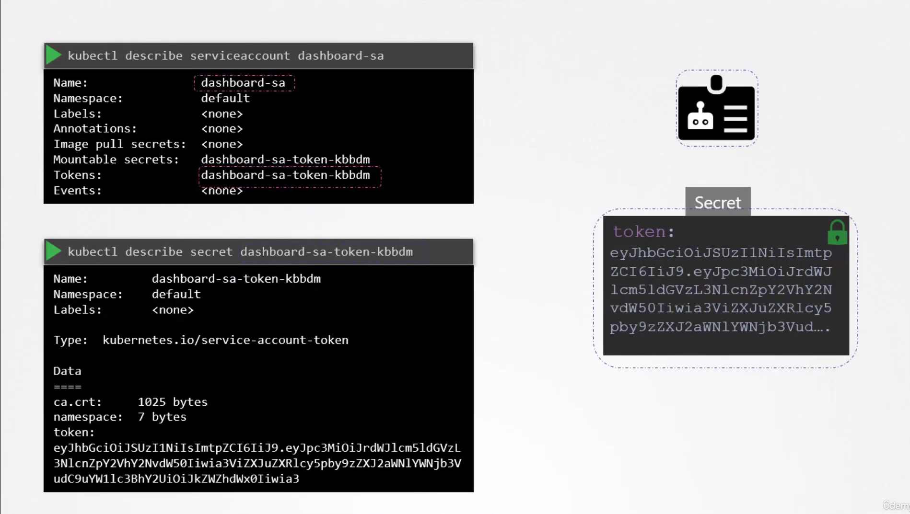
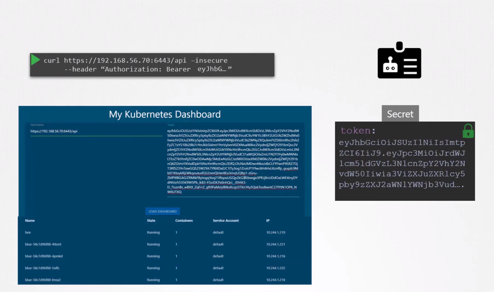
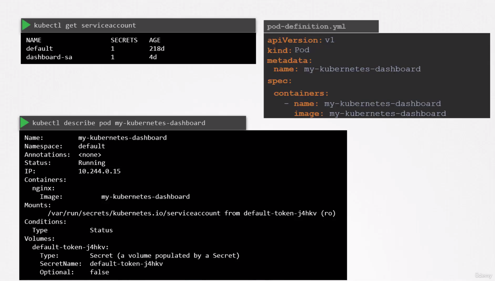

- There are two types of accounts in Kubernetes:
  - **`User account`** : A user account could be for an administrator accessing the cluster to perform administrative tasks, or a developer accessing the cluster to deploy applications etc.
  - **`Service account`** : A service account could be an account used by an application to interact with a Kubernetes cluster.
    For example, a monitoring application like `Prometheus uses a service account to pull the Kubernetes API for performance metrics.` An automated build tool like Jenkins uses service accounts to deploy applications on the Kubernetes cluster.
    
    

# Service Account

- In Kubernetes, a service account is an entity that provides an identity for processes running in a pod. It is used to authenticate and authorize actions performed by those processes within the Kubernetes cluster.
- Let's take an example.
  I've built a simple Kubernetes dashboard application named My Kubernetes Dashboard. It's a simple application built in Python, and all that it does when deployed is retrieve the list of pods on a Kubernetes cluster by sending a request to the Kubernetes API and displays on a webpage. In order for my application `to query the Kubernetes API, it has to be authenticated. For that, we use a Service Account.`
  
  
- When the service account is created, it first creates the service account object, and then generates a `token` for that service account. It then creates a secret object and stores that token inside the secret object. The `token` is what the external application My Kubernetes Dashboard in this case, use while authenticating to the Kubernetes API.
  
  
- For example, using curl, you could provide the bearer token as an authorization header while making a REST call to the Kubernetes API.
  

--- 

Important Note:

- What if your third-party application is hosted on the Kubernetes cluster itself?
- For example, we can have our custom Kubernetes dashboard application or the `Prometheus` application deployed on the Kubernetes cluster itself.
  In that case, this whole process of exporting the token and configuring the third-party application to use it can be made simple by `automatically mounting the service token secret as a volume inside the pod hosting the third-party application.`
  This way, the token to access the Kubernetes API is already placed inside the pod, can be easily read by the application and you do not need to provide it manually.

---

# Default Service Account in Kubernetes

In Kubernetes, a default service account named `default` is automatically created for every namespace. Each namespace has its own `default` service account. When a pod is created within a namespace, the default service account token is automatically mounted to that pod as a volume.

## Automatic Creation of Default Service Account

- For every namespace in Kubernetes, a `default` service account is automatically generated.
- The `default` service account is associated with a token named `default-token`.
- This token is used for basic Kubernetes API queries and is mounted to every pod created within the namespace.
- The secret containing the token for the `default` service account is mounted automatically at the location `/var/run/secret/kubernetes.io/serviceaccount` inside the pod, even without specifying any secrets or volume mounts explicitly.
  
  

Note : Remember that the default service account is very much restricted. It only has permission to run basic Kubernetes API queries.

# Use Cases of Service Accounts:

1. **Authentication**:
   
   - When a pod needs to interact with the Kubernetes API server or other cluster resources, it requires a way to authenticate itself. Service accounts provide this authentication mechanism.
   - Kubernetes assigns a unique service account to each pod, either by default or by explicitly specifying it in the pod specification.
2. **Authorization**:
   
   - Service accounts are used to grant specific permissions (RBAC - Role-Based Access Control) to pods within the Kubernetes cluster.
   - By associating a service account with appropriate roles or cluster roles, administrators can control the actions that the pod can perform within the cluster.
3. **Use Cases**:
   
   a. **Accessing Kubernetes API**:
   
   - Pods often need to interact with the Kubernetes API to perform tasks such as querying cluster state, creating or modifying resources, etc.
   - Service accounts provide a secure way for pods to authenticate themselves to the Kubernetes API server.
   
   b. **Accessing other cluster resources**:
   
   - Pods might need to access other cluster resources like ConfigMaps, Secrets, or other pods/services.
   - Service accounts, when associated with appropriate roles, ensure that pods have the necessary permissions to access these resources securely.
   
   c. **CI/CD Pipelines**:
   
   - In a CI/CD pipeline, jobs or tasks running within pods may need to deploy or manage resources in the Kubernetes cluster.
   - By using service accounts with limited permissions, you can ensure that these tasks have only the necessary access to perform their operations, reducing the risk of accidental or malicious actions.
   
   d. **External Service Interaction**:
   
   - Sometimes, pods need to interact with external services or APIs.
   - Service accounts can be used to securely manage authentication credentials required for these interactions, reducing the risk of exposing sensitive information.
   
   e. **Application-specific Access Control**:
   
   - Different applications running in pods may have varying access requirements within the cluster.
   - By using different service accounts with tailored permissions for each application, you can enforce least privilege principles and enhance security.

