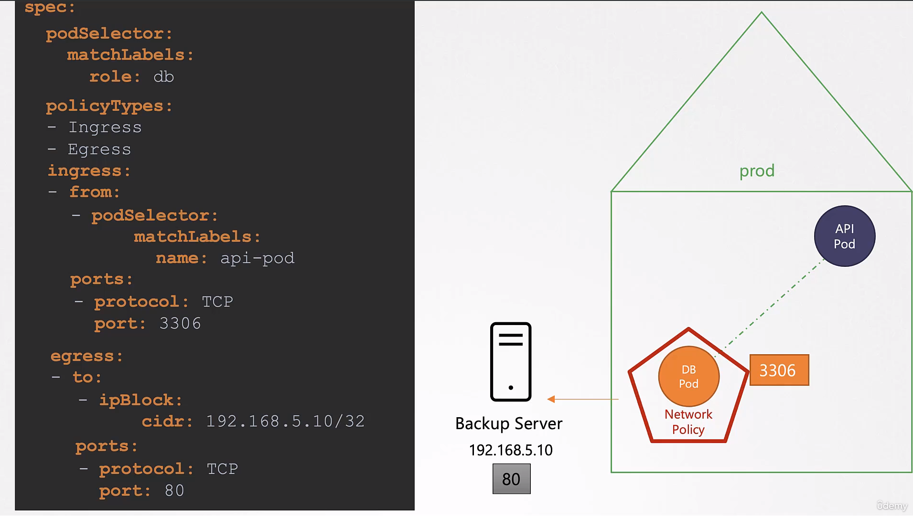

# Network Policies

- Take me to [Video Tutorials](https://kodekloud.com/topic/network-policies-3/)
- Trafic flowing through a webserver serving frontend to users an app server serving backend API and a database server
  
  
- There are two types of traffic
  
  - Ingress
  - Egress
  
  

---

* By default, pods in a Kubernetes cluster can communicate with each other using IPs, pod names, or services and
* Kubernetes implements an "all-allow" rule by default, allowing traffic between any pods or services within the cluster.
  
  

---

## Network Policy

* Network policies are used to restrict communication between pods.
  For example - We do not want the front end web server to be able to communicate with the database server directly? That is where you would implement a network policy to allow traffic to the DB server only from the API server.* Policies specify rules for ingress (incoming) and egress (outgoing) traffic.
  
  
* Policies specify rules for ingress (incoming) and egress (outgoing) traffic.
  
  
* Policies are defined as Kubernetes objects and linked to pods using labels and selectors.
  
  

## Network Policy Rules


## Create network policy

- To create a network policy
  
  ```
  apiVersion: networking.k8s.io/v1
  kind: NetworkPolicy
  metadata:
   name: db-policy
  spec:
    podSelector:
      matchLabels:
        role: db
    policyTypes:
    - Ingress
    ingress:
    - from:
      - podSelector:
          matchLabels:
            role: api-pod
      ports:
      - protocol: TCP
        port: 3306
  ```
  
  ```
  $ kubectl create -f policy-definition.yaml
  ```
  
  
  
  

## Note

* Network policy enforcement depends on the network solution used in the Kubernetes cluster.
* Not all network solutions support network policies (e.g., Flannel).
  
  

# Detailed Example for Network Policy:




#### K8s Reference Docs

- https://kubernetes.io/docs/concepts/services-networking/network-policies/
- https://kubernetes.io/docs/tasks/administer-cluster/declare-network-policy/

