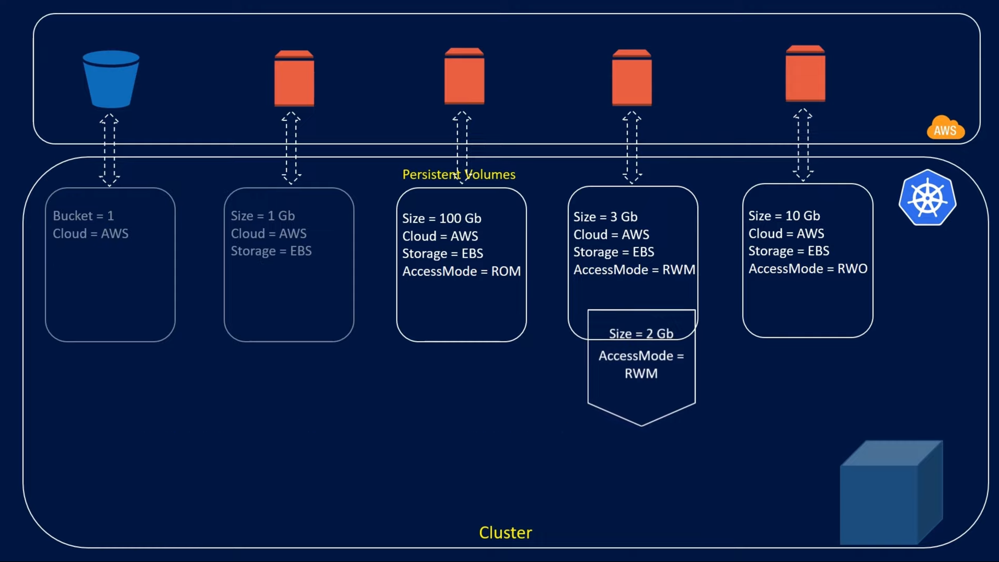

## Persistent Volumes, Persistent Volume Claims, and Storage Classes in Kubernetes

### Challenges of Storing Data in Pods

* **Pod restarts:** When a pod restarts, any data stored locally within the pod is lost.
* **Pod rescheduling:** Pods can be rescheduled to different nodes in the cluster due to various reasons (e.g., scaling, node failure). Local storage on the original node wouldn't be accessible to the rescheduled pod.

### Persistent Volumes (PVs)

- A persistent volume (PV) is a piece of storage that is provisioned by an administrator and made available to pods. This storage can be provisioned by the administrator on various providers like cloud storage (AWS EBS, Azure Disk, GCP Persistent Disk), local storage on the cluster nodes, or network storage (NFS). PVs act as the actual storage resource that pods can consume.
  
  
  If using AWS EBS:
  
  If using a dedicated NFS Server:
  

* Defined in a YAML file specifying details like:
  * **capacity:** Storage size of the PV (e.g., 10Gi, 500Mi).
  * **accessModes:** Defines how the volume can be accessed by the pods. (e.g., ReadWriteOnce, ReadOnlyMany, ReadWriteMany).
  * **reclaimPolicy:** Determines what happens to the volume's data when the PVC bound to it is deleted or released.(e.g., Recycle - Kubernetes attempts to reclaim the storage, Delete - Storage is deleted).

### Persistent Volume Claims (PVCs)

- A persistent volume claim (PVC) is a request to use the Persistent Volume (PV) storage submitted by a pod.
- Once a PVC is created, Kubernetes tries to find a suitable PV that matches the PVC's requirements. This matching process considers factors like `access mode`, `storage size`, and `storage class` etc.
- If properties not matches or PV is not available for the PVC then it will display the pending state.
  
  ```
  kind: PersistentVolumeClaim
  apiVersion: v1
  metadata:
  name: myclaim
  spec:
    accessModes: [ "ReadWriteOnce" ]
    resources:
        requests:
          storage: 1Gi
  ```

### PV and PVC Binding

- Kubernetes decides on what basis a PV (Persistent Volume) attaches to a PVC (Persistent Volume Claim).
- Before binding any PVC to a PV, Kubernetes checks two things: `size` and `access modes`.
- Inside a cluster, there can be multiple PVs of different sizes, and based on the resource requirement of the pod, we can also create PVCs. Let's say we created a PVC with a resource requrement of 2GB. In that case, not all PVs will qualify during the first selection, so they will be filtered out.
- There is a second factor which is access modes. Access modes determine how the storage created by us will access the pod. We have three access modes: the first is ReadWriteOnce, the second is ReadOnlyMany, and the third is ReadWriteMany. ReadWrite means that a pod will access the storage to perform both read and write operations. ReadOnlyMany means that multiple pods will only read data from storage, and the last one means that multiple pods can access storage to perform both read and write operations.
  
  
- Now, suppose we created a PVC of size 1GB, and in the cluster, only one PV matched its specifications, and its size was 10GB. If its access modes also match with PVC, then Kubernetes will bind that PV to the PVC, and the remaining 9GB of storage will be wasted because a PV can only be bound to one PVC.
- Suppose another PVC of size 2GB comes into the cluster, and no PV matches its specifications. In such a condition, the PVC remains in a pending state; no binding happens, and no one else is affected.
  

### Provisioning Strategies

- **Static Provisioning:**
  We've seen how the cluster administrator creates storage on the cloud and the respective PV creates in the cluster. And the user creates PVC according to the retirement of their pod. Here, the cluster administrator creating storage and the PV creating manually in the cluster is called static provisioning, where you manually provision things.
- **Dynamic Provisioning:**
  
  But there can also be a condition where the user creates a PVC, and there is no matching of PV in the cluster to bind. Will the user keep requesting the administrator to create a PV according to their retirement? In such a condition, dynamic provisioning comes into play.
  
  - In dynamic provisioning, the administrator uses storage classes to instruct them on creating PVs automatically and keeping them ready in the cluster. Now, let's talk about what storage classes are.
  - In simple terms, the cluster administrator who was manually creating storage and PVs in the cluster, is automatically done by storage classes. If we look at the yaml file of the storage class, there is a field called provisioner where we specify which cloud provider we want to provision storage on.
  - Suppose we want to create an EBS on AWS, then we mention gp2 in the type field of the parameter. And the last important field is reclaim policy, where we mention whether we want to retain or delete the data. Since storage class creates PVs, we specify the reclaim policy of the PV in the PVC yaml file.
  - Apart from these three, there are also some other fields which we will understand as we encounter them. So, this is how we create storage class, PV, and PVC together, and how the entire flow works within the community.
  - __Storage Classes__:
    
    ```
    apiVersion: storage.k8s.io/v1
        kind: StorageClass
        metadata:
          name: fast
        provisioner: kubernetes.io/aws-ebs
        parameters:
          type: gp2
        volumeBindingMode: WaitForFirstConsumer
        reclaimPolicy: Retain
    ```
    
    Use in PVC:
    
    ```
    kind: PersistentVolumeClaim
    apiVersion: v1
    metadata:
    name: myclaim
    spec:
      accessModes: [ "ReadWriteOnce" ]
      resources:
          requests:
            storage: 1Gi
      storageClassName: fast
    ```
  
  #### Attributes of Storage Class:
  
  1. ​**volumeBindingMode**​: `volumeBindingMode` is an attribute of the StorageClass resource that determines when volume binding should occur. It can take one of the following values:
  
      * `Immediate`: With this mode, volume binding occurs as soon as a PVC using this StorageClass is created. Kubernetes will immediately attempt to bind a PV that matches the requirements of the PVC. If no suitable PV is available, the PVC remains in a pending state until a PV becomes available or is dynamically provisioned.
      * `WaitForFirstConsumer`: In this mode, volume binding is delayed until the PVC is actually used by a pod. Kubernetes waits until a pod using the PVC is scheduled onto a node before binding a PV to the PVC. This mode is useful when you want to ensure that storage resources are only provisioned when they are actually needed by a pod, which can help to reduce resource wastage.
  
  2. ​**provisioner**​: `provisioner` specifies the provisioner responsible for creating persistent volumes. A provisioner is essentially a plugin or controller that interacts with the underlying storage system (e.g., cloud provider's storage service, local disk, network storage, etc.) to dynamically provision volumes based on PVC requests.
     For example, if you're using AWS Elastic Block Store (EBS) as your storage backend, you would specify the provisioner as `kubernetes.io/aws-ebs`.
  3. ​**reclaimPolicy**​: The `reclaimPolicy` attribute is used to specify what action should be taken when a PersistentVolume (PV) is released.


      There are three reclaim policies:

      - `Retain`: With this policy, the volume is not deleted automatically when the corresponding PersistentVolumeClaim (PVC) is deleted. Instead, the PV retains the data and must be manually deleted by the administrator. This policy is useful when you want to retain data even after the associated PVC is deleted.
      - `Delete`: With this policy, the volume is automatically deleted when the corresponding PVC is deleted. The underlying storage resource is also deleted. This is the default policy if none is specified.
      - `Recycle` (Deprecated): This policy is deprecated and may be removed in future versions of Kubernetes. With this policy, the volume is not deleted when the PVC is deleted, but the contents are not retained either. Kubernetes attempts to delete the contents of the volume and make it available for reuse.


