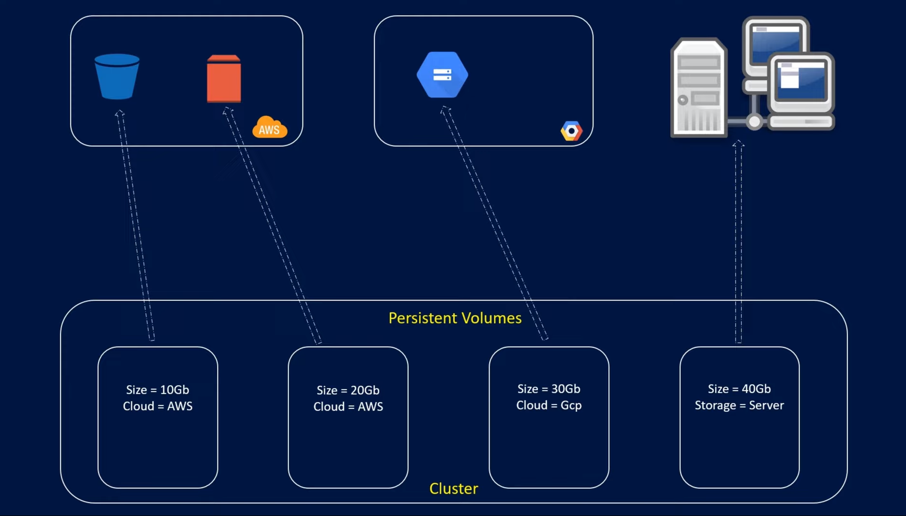
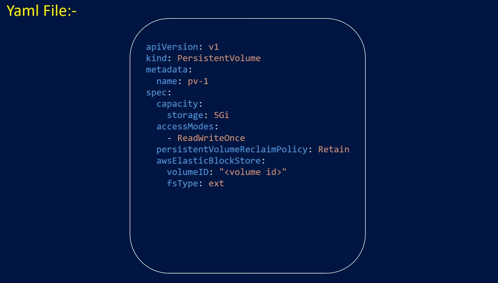

## Persistent Volumes, Persistent Volume Claims, and Storage Classes in Kubernetes


### Challenges of Storing Data in Pods

* **Pod restarts:** When a pod restarts, any data stored locally within the pod is lost.
* **Pod rescheduling:** Pods can be rescheduled to different nodes in the cluster due to various reasons (e.g., scaling, node failure). Local storage on the original node wouldn't be accessible to the rescheduled pod.

### Persistent Volumes (PVs)

- A persistent volume (PV) is a piece of storage that is provisioned by an administrator and made available to pods. This storage can be provisioned by the administrator on various providers like cloud storage (AWS EBS, Azure Disk, GCP Persistent Disk), local storage on the cluster nodes, or network storage (NFS). PVs act as the actual storage resource that pods can consume.
  
  
  If using AWS EBS:
  
  If using a dedicated NFS Server:
  

* Defined in a YAML file specifying details like:
  * **capacity:** Storage size of the PV (e.g., 10Gi, 500Mi).
  * **accessModes:** Defines how the volume can be accessed by the pods. (e.g., ReadWriteOnce, ReadOnlyMany, ReadWriteMany).
  * **reclaimPolicy:** Determines what happens to the volume's data when the PVC bound to it is deleted or released.(e.g., Recycle - Kubernetes attempts to reclaim the storage, Delete - Storage is deleted).

### Persistent Volume Claims (PVCs)

- A persistent volume claim (PVC) is a request to use the Persistent Volume (PV) storage submitted by a pod. It acts as a resource request for a PV that meets specific criteria.
- Similar to requesting CPU or memory resources, a pod specifies its storage needs through a PVC. The PVC defines the size of the storage required and the access mode (read-write-once, read-only, read-write many).


### Storage Classes

A storage class provides a way to automate the provisioning of PVs based on predefined storage types and configurations. It acts as a template for PVs, defining characteristics like performance tier (high performance, standard), reclaim policy (retain or delete the PV when the PVC is deleted), and the underlying storage provider details (e.g., provisioning parameters for AWS EBS).

**Key Points about Storage Classes:**

* Automates PV provisioning based on predefined configurations.
* Defines storage type, reclaim policy, and underlying storage provider details.
* Allows defining different storage options for pods based on their needs.
* Defined in a YAML file specifying details like provisioner (e.g., kubernetes.io/aws-ebs), parameters for the provisioner (e.g., volume type for AWS EBS), reclaim policy, and optionally, specific storage class name.

### Provisioning Strategies

There are two main strategies for provisioning PVs:

* **Static Provisioning:**
  * The administrator manually creates both the PV and the PVC with specific details about storage capacity, access modes, and underlying storage configuration.
  * This approach is suitable for smaller clusters or workloads with predictable storage requirements.
* **Dynamic Provisioning:**
  * The administrator creates a storage class defining the desired storage characteristics.
  * When a pod creates a PVC referencing a specific storage class, the Kubernetes system automatically provisions a PV that matches the PVC requirements based on the storage class definition.
  * This approach is ideal for larger clusters or workloads with varying storage needs, offering greater flexibility and automation.

### How PVs, PVCs, and Storage Classes Work Together

1. The administrator provisions PVs on the chosen storage provider or configures local/network storage options.
2. The administrator defines storage classes with specific configurations for different storage tiers or types.
3. Pods specify their storage needs through PVCs, requesting a certain size and access mode. Optionally, they can reference a specific storage class for automated provisioning.
4. When a PVC is created:
   * If a matching static PV exists, the PVC is bound to that PV.
   * If dynamic provisioning is used and a storage class is referenced in the PVC, the Kubernetes system automatically provisions a new PV

# Persistent Volume Claims

- Take me to [Lecture](https://kodekloud.com/topic/persistent-volume-claims-4/)

In this section, we will take a look at **Persistent Volume Claim**

- Now we will create a Persistent Volume Claim to make the storage available to the node.
- Volumes and Persistent Volume Claim are two separate objects in the Kubernetes namespace.
- Once the Persistent Volume Claim created, Kubernetes binds the Persistent Volumes to claim based on the request and properties set on the volume.
  
  
- If properties not matches or Persistent Volume is not available for the Persistent Volume Claim then it will display the pending state.

```
pvc-definition.yaml

kind: PersistentVolumeClaim
apiVersion: v1
metadata:
  name: myclaim
spec:
  accessModes: [ "ReadWriteOnce" ]
  resources:
   requests:
     storage: 1Gi
```

```
pv-definition.yaml

kind: PersistentVolume
apiVersion: v1
metadata:
    name: pv-vol1
spec:
    accessModes: [ "ReadWriteOnce" ]
    capacity:
     storage: 1Gi
    hostPath:
     path: /tmp/data
```

#### Create the Persistent Volume

```
$ kubectl create -f pv-definition.yaml
persistentvolume/pv-vol1 created

$ kubectl get pv
NAME      CAPACITY   ACCESS MODES   RECLAIM POLICY   STATUS      CLAIM   STORAGECLASS   REASON   AGE
pv-vol1   1Gi        RWO            Retain           Available                                   10s
```

#### Create the Persistent Volume Claim

```
$ kubectl create -f pvc-definition.yaml
persistentvolumeclaim/myclaim created

$ kubectl get pvc
NAME      STATUS    VOLUME   CAPACITY   ACCESS MODES   STORAGECLASS   AGE
myclaim   Pending                                                     35s

$ kubectl get pvc
NAME      STATUS   VOLUME    CAPACITY   ACCESS MODES   STORAGECLASS   AGE
myclaim   Bound    pv-vol1   1Gi        RWO                           1min
```

#### Delete the Persistent Volume Claim

```
$ kubectl delete pvc myclaim
```

#### Delete the Persistent Volume

```
$ kubectl delete pv pv-vol1
```

#### Kubernetes Persistent Volume Claims Reference Docs

- https://kubernetes.io/docs/concepts/storage/persistent-volumes/#persistentvolumeclaims
- https://kubernetes.io/docs/reference/generated/kubernetes-api/v1.18/#persistentvolumeclaim-v1-core
- https://docs.cloud.oracle.com/en-us/iaas/Content/ContEng/Tasks/contengcreatingpersistentvolumeclaim.htm

