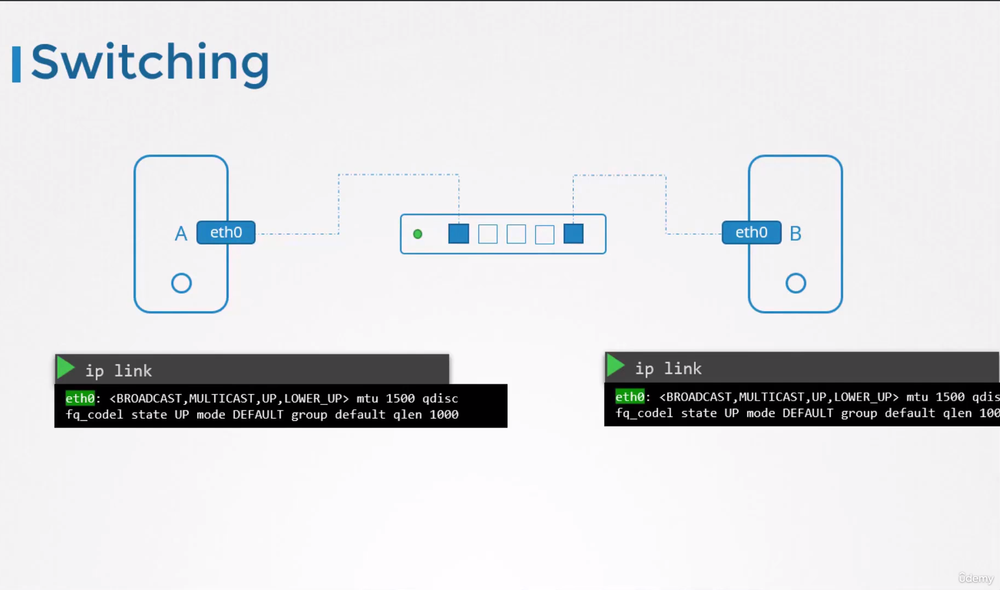
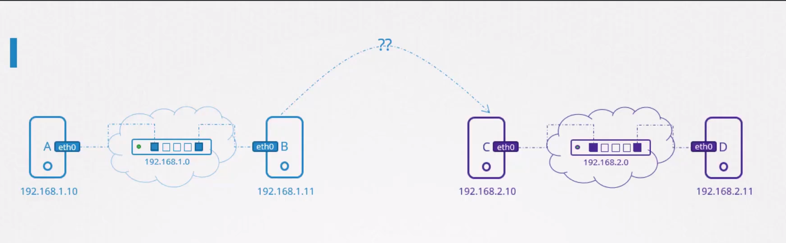
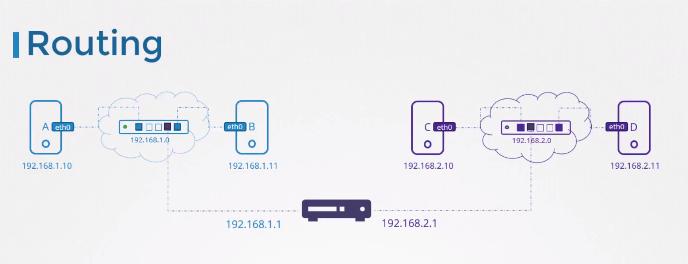
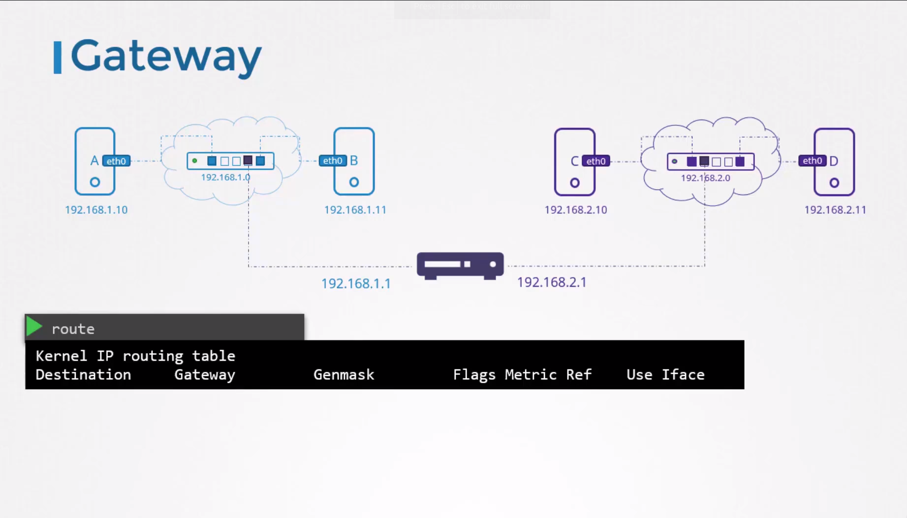
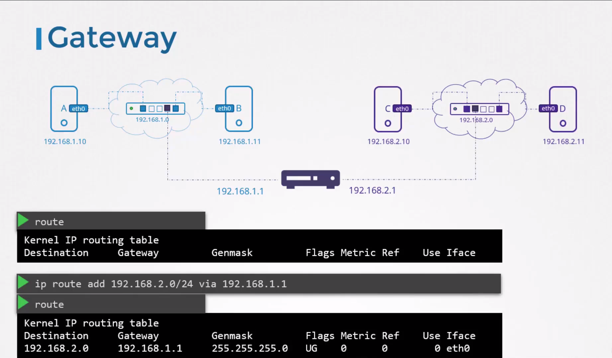
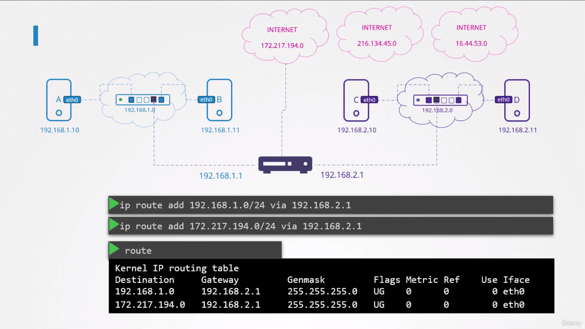
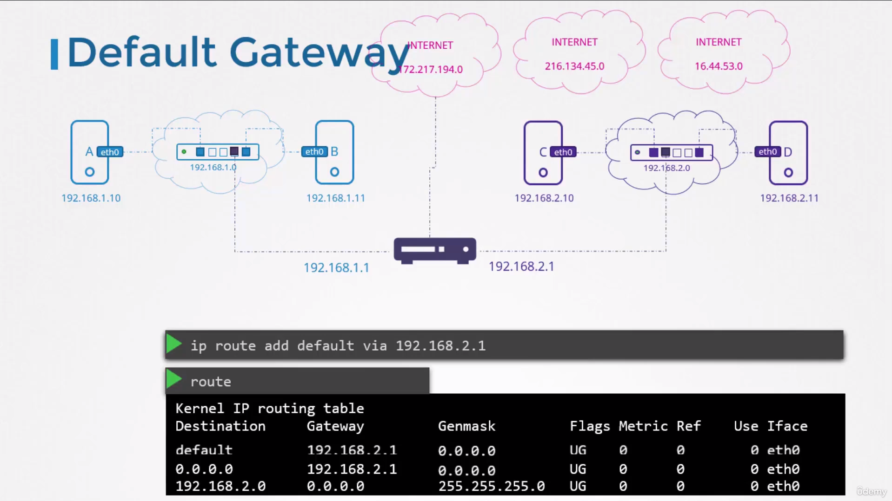
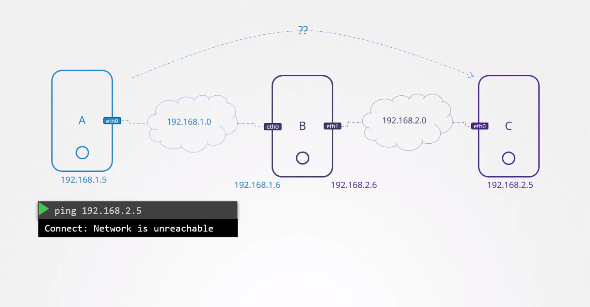

# Pre-requisite Switching Routing Gateways

This lecture series covers basic networking concepts, including switching, routing, gateways, DNS, CoreDNS, and network namespaces in Linux. It is intended for system administrators and application developers who need to understand networking fundamentals but may not be network engineers.

## Switching

* So what is a `Network`?
  
  - We have two computers, A and B, laptops, desktops, VMs on the cloud, wherever, how does system A reach and communicate to B?
  - We connect them to a `Switch`and the`Switch creates a network` containing the two systems.
  - To connect the two systems to a switch, we need an `Interface` (eth0) on each host: physical or virtual, depending on the host. To see the interfaces for the host, we use the IP link command.
    
    
  - To see the interfaces for the host
    
    ```
    $ ip link
    ```
  - Let's assume the Switch creates a network with the address 192.168.1.0
  - We then assign the systems with IP addresses on the same network. For this, we use the command ip addr.
    
    ```
    $ ip addr add 192.168.1.10/24 dev eth0  [System A]
    ```
    
    ```
    $ ip addr add 192.168.1.11/24 dev eth0  [System B]
    ```
  - Once the links are up and the IP addresses are assigned, the two systems A and B can now communicate with each other through the switch. The switch can only enable communication within a network, which means it can receive packets from a host on the network and deliver it to other systems within the same network.
    

## Routing

- But what if we have another network containing systems C and D at address 192.168.2.0 and the systems have IP address 192.168.2.10 and 198.168.2.11 respectively. `How does a system in one network reach a system in the other network?`
  
  

* That's where **`Router`** comes in, a router connects two or more networks together. Think of it as another server with many network ports.
* Since it connects to the two separate networks, it gets two IPs assigned, one on each network. In the first network, we assign it an IP address 192.168.1.1 And in the second, we assign it an IP 192.168.2.1
  
  

- To see the existing routing table on the host system.
  
  ```
  $ route
  ```
  
  ```
  $ ip route show
  or
  $ ip route list
  ```

## Gateway

- When system B tries to send a packet to system C, how does it know where the router is on the network to send the packet through? The router is just another device on the network. There could be many other such devices. That's where we configure the systems with a `Gateway`
  *Analogy* : If the Network is a room, then the gateway is a door to the outside world or to the other networks or to the internet. The systems need to know where that door is to go through that.
- To see the existing routing table on the host system.
  
  ```
  $ route
  ```
  
  ```
  $ ip route show
  or
  $ ip route list
  ```
  
  
- As you can see, there are no routing configurations as of now. Hence, system B will not be able to reach system C.
- To configure a gateway on system B to reach the systems on network 192.168.2.0, run the IP route add command and specify that you can reach the 192.168.2.0 network through the door or gateway at 192.168.1.1
  
  ```
  $ ip route add 192.168.2.0/24 via 192.168.1.1
  ```
- Running the route command again shows that we have a route added to reach the 192.168.2.0 series network through the router.
  **`Remember, this has to be configured on all the systems.`**
  **`For example, if the system C wants to send a packet to system B, then you need to add a route on system C's routing table to access the network at 192.168.1.0 through the router configured with the IP address 192.168.2.1`**
  
- Now, suppose these systems need access to the internet. Say they need access to Google at 172.217.194.0 network on the internet. So you connect the router to the internet, and then add a new route in your routing table to route all traffic to the network 172.217.194 through your router. But there are thousands of sites on different networks on the internet and it would definitely not be possible to add routes for each. So, instead of adding a routing table entry for the same router's IP address for each of those networks, you can simply say for any network, use this router as the `default` gateway.
  
- Remember, instead of the word `default`, you could also say `0.0.0.0`. It means any IP destination. Both of these lines mean the same thing. A 0.0.0.0 entry in the gateway field indicates that you don't need a gateway.
  
  
- To add a default route.
  
  ```
  $ ip route add default via 192.168.2.1
  ```
- To check the IP forwarding is enabled on the host.
  
  ```
  $ cat /proc/sys/net/ipv4/ip_forward
  0
  
  $ echo 1 > /proc/sys/net/ipv4/ip_forward
  ```
- Enable packet forwarding for IPv4.
  
  ```
  $ cat /etc/sysctl.conf
  
  # Uncomment the line
  net.ipv4.ip_forward=1
  ```
- To view the sysctl variables.
  
  ```
  $ sysctl -a
  ```
- To reload the sysctl configuration.
  
  ```
  $ sysctl --system
  ```

## How to Configure a Linux Host as Router:

### Scenario

- How do we get A to talk to C? Basically, if I try to ping 2.5 from A, it would say network is unreachable.
  
  
- This document outlines how to configure a Linux host (Host B) as a router to enable communication between two separate networks 192.168.1.0 and 192.168.2.0
- **Network Layout:**
  
  * Host A: 192.168.1.5 (Network 1)
  * Host B: 192.168.1.6 (Network 1) & 192.168.2.6 (Network 2)
  * Host C: 192.168.2.5 (Network 2)

### Problem

- By default, Host A cannot reach Host C due to separate networks and lack of routing information.

### Solution

1. **Routing Table Entries:**
   * On Host A: Add a route to network 192.168.2.0 with gateway 192.168.1.6 (Host B).
   * On Host C: Add a route to network 192.168.1.0 with gateway 192.168.2.6 (Host B).
2. **Enable Packet Forwarding on Host B:**
   * Edit `/proc/sys/net/ipv4/ip_forward` and set the value to 1 (temporarily enables forwarding).
   * Modify `/etc/sysctl.conf` to set `net.ipv4.ip_forward` to 1 (persists across reboots).

**Explanation:**

* Routing tables tell hosts how to reach specific networks.
* Packet forwarding allows Host B to send packets received on one interface (e.g., Network 1) out the other interface (e.g., Network 2).
* By default, forwarding is disabled for security reasons.

**Note:** This is a basic setup. More complex configurations might involve additional steps.

## Commands - Key Take Aways

- **`ip link`**: Lists and modifies interfaces on the host.
- **`ip addr`**: Displays IP addresses assigned to interfaces.
- **`ip addr add`**: Sets IP addresses on interfaces.
  
  - Changes made with these commands are temporary and valid until a restart.
- **`ip route`** or **`route`**: Views the routing table.
- **`ip route add`**: Adds entries into the routing table.
- To make changes persistent:
  
  - Edit `/etc/network/interfaces` file.
- To check if IP forwarding is enabled on a host (that is configured as a router):
  
  ```
  cat /proc/sys/net/ipv4/ip_forward
  1
  ```

