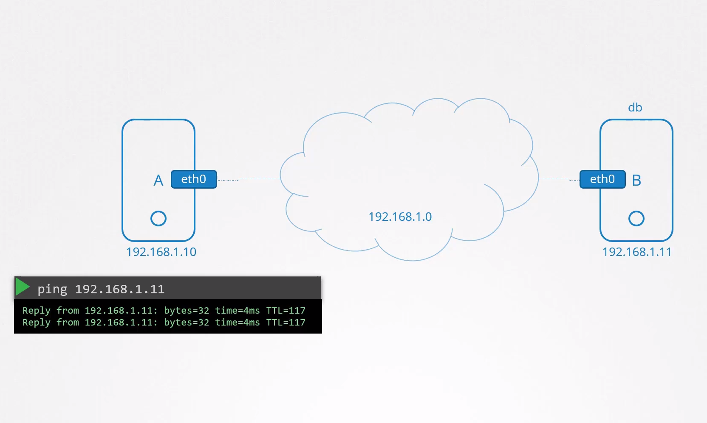
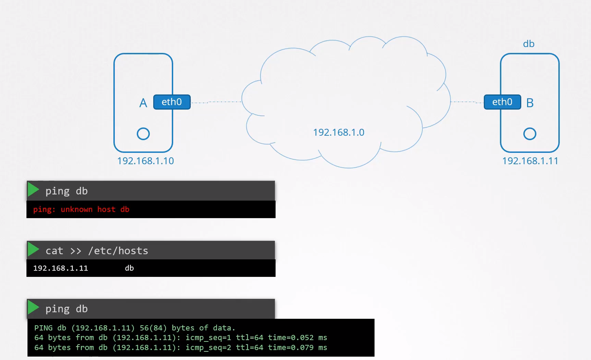
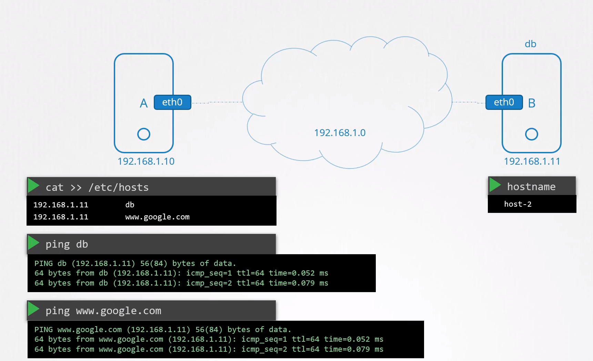
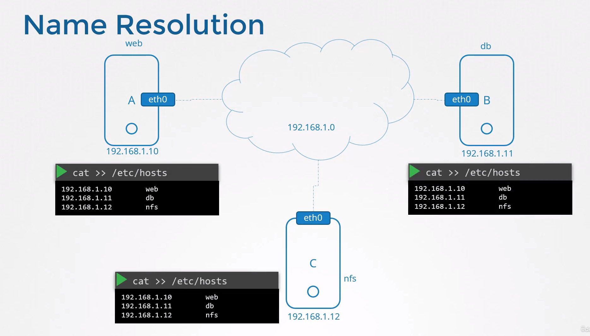
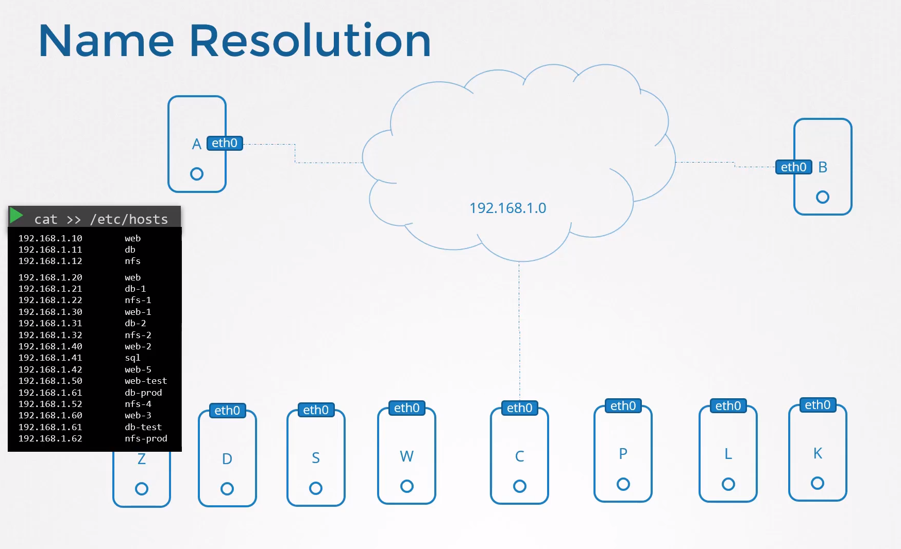
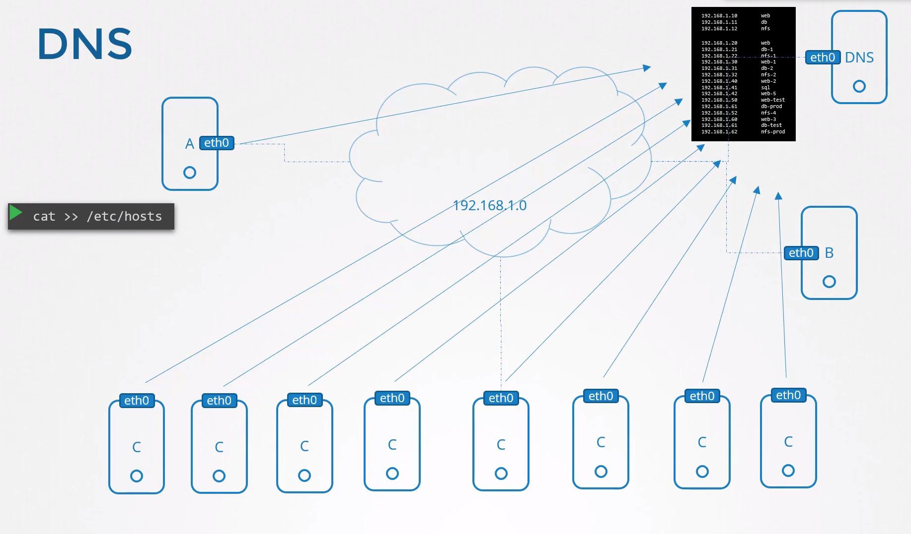
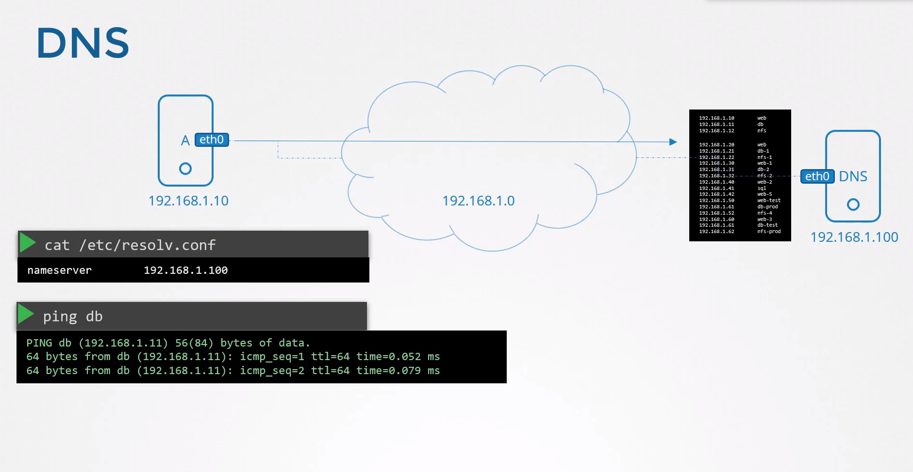
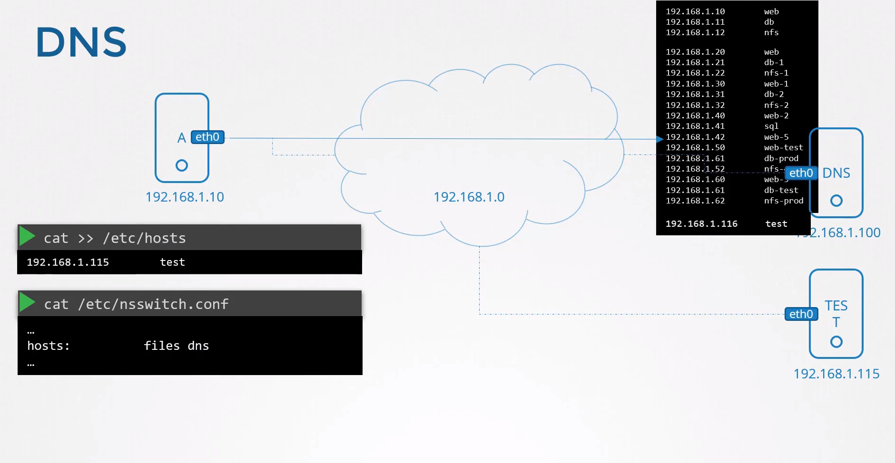
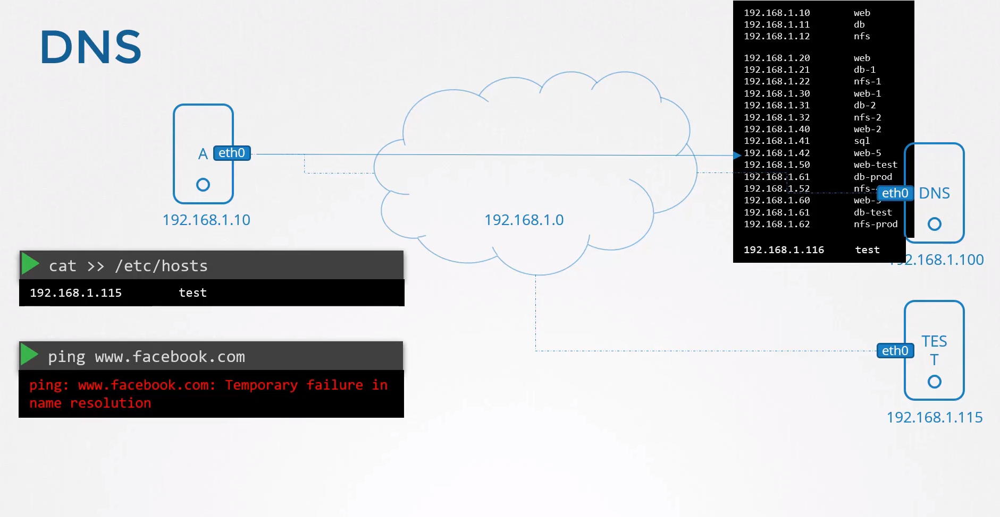
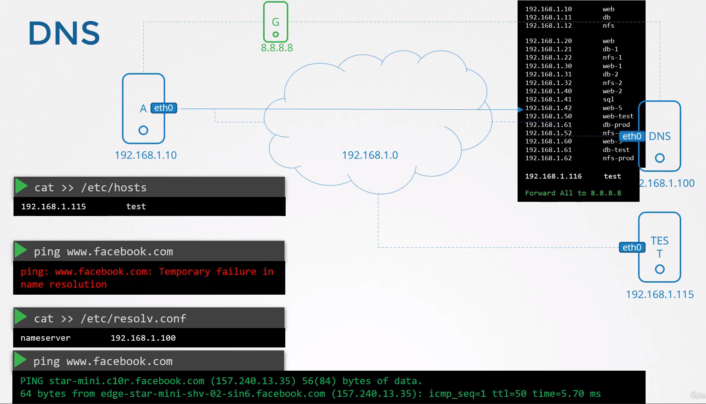

# Pre-requisite DNS

- Take me to [Lecture](https://kodekloud.com/topic/prerequsite-dns/)

1. **Setting up Hostnames and IP Address Mapping:**
   
   - Two computers, A and B, have been assigned IP addresses 192.168.1.10 and 192.168.1.11 respectively. You are able to ping other computer using it's IP address.
     
     
   - Instead of having to remember the IP address of system B, you decide to give it a name db.
   - If you try to ping `db` now, you would see that host A is unaware of a host named db.
     So how do you fix that?
   - To resolve this, an entry is to be added to the `/etc/hosts` file on host A, mapping the hostname 'db' to the IP address 192.168.1.11.
     
2. **Hostname Resolution and `/etc/hosts` File:**
   
   - Host A relies on the `/etc/hosts` file for name resolution.
   - Entries in this `/etc/hosts` serve as the source of truth for hostname-to-IP mappings on the local system, regardless of the actual hostname of remote systems.
   - Multiple names can point to the same system; for example, host A can resolve both 'db' and 'www.google.com' to the IP address of system B.
     
     
3. **Limitations of Local Host Configuration:**
   
   - Within a small network of few systems, you can easily get away with the entries in the /etc/hosts file. On each system, you can specify which are the other systems in the network, and that's how it was done in the past.
     
     
   - However managing numerous entries in the `/etc/hosts` file becomes cumbersome as the network grows. `If one of the servers IP gets changed, you have to modify the entries in all of the hosts' /etc/hosts file.`
     
4. **Introduction of DNS Server:**
   
   - To centralize hostname resolution, a DNS server is introduced to manage all the enrties centrally. We then point all hosts to look up for that server if they need to resolve a host name to an IP address instead of its own /etc/hosts files.
   - `How do we point our host to a DNS server?`
     
   - Every host has a DNS resolution configuration file at `/etc/resolv.conf`. You add an entry into it specifying the IP address of the DNS server. We say `nameserver` and point it to our DNS Server i.e `192.168.1.100`, and that should be it. Once this is configured on all of your hosts, every time a host comes up across a host name that it does not know about, it looks it up from the DNS server.
     
     
5. **DNS Resolution Process:**
   
   - With DNS configured, hosts query the DNS server for hostname resolution.
   - Updates to IP addresses are managed centrally on the DNS server, simplifying maintenance.
6. **Combining Local and DNS Resolution:**
   
   - While DNS is the primary method for hostname resolution, local `/etc/hosts` entries can still be utilized for specific cases.
     *For example* : Say you were to provision a test server for your own needs. You don't think others would need to resolve the server by its name, so it may not be added to the DNS server. In that case, you can add an entry into your host /etc/hosts file to resolve this server. You can now resolve the server. However, no other system will be able to do that. So a system is able to use host name to IP mapping from the /etc/hosts file locally as well as from a remote DNS server.
7. **Order of Resolution:**
   
   - The host first looks in the local /etc/hosts file and then looks at the nameserver. So if it finds the entry in the local /etc/hosts file, it uses that. If not, it looks for that host in the DNS server. But that order can be changed.
   - The order of hostname resolution is defined in the `/etc/nsswitch.conf` file.
     
     
8. **Fallback DNS Servers:**
   
   - What if you try to ping a server that is not in either list?
     For example, I try and ping www.facebook.com. I don't have facebook.com in my /etc/hosts file and I don't have it in my DNS server, either. So in that case, it will fail.
     
     
   - We can add another entry into our /etc/resolv.conf file to point to a nameserver that knows Facebook.
     *For example*: Google's public DNS Server 8.8.8.8 is a common well-known public nameserver available on the internet hosted by Google that knows about all websites on the internet.
9. **Configuring DNS Forwarding:**
   
   - You can have multiple public nameservers like this configured on your host, but then you'll have to configure that on all your hosts in the network. In that case, `you can configure the DNS server itself to forward any unknown host names to the public name server on the internet.`
     
     
     ```
     Forward All to 8.8.8.8 as an entry in DNS Server
     ```

## Domain Names


## Search Domain


## Record Types


## Networking Tools

- Useful networking tools to test dns name resolution.

#### nslookup

```
$ nslookup www.google.com
Server:         127.0.0.53
Address:        127.0.0.53#53

Non-authoritative answer:
Name:   www.google.com
Address: 172.217.18.4
Name:   www.google.com
```

#### dig

```
$ dig www.google.com

; <<>> DiG 9.11.3-1 ...
;; Got answer:
;; ->>HEADER<<- opcode: QUERY, status: NOERROR, id: 8738
;; flags: qr rd ra; QUERY: 1, ANSWER: 1, AUTHORITY: 0, ADDITIONAL: 1

;; OPT PSEUDOSECTION:
; EDNS: version: 0, flags:; udp: 65494
;; QUESTION SECTION:
;www.google.com.                        IN      A

;; ANSWER SECTION:
www.google.com.         63      IN      A       216.58.206.4

;; Query time: 6 msec
;; SERVER: 127.0.0.53#53(127.0.0.53)
```

