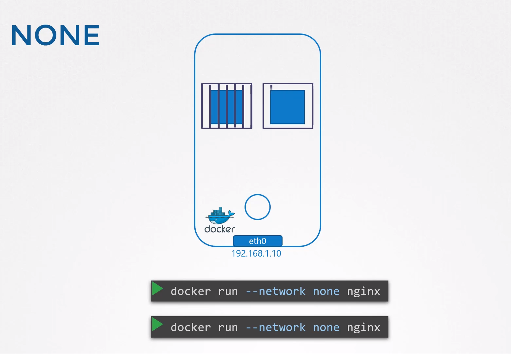
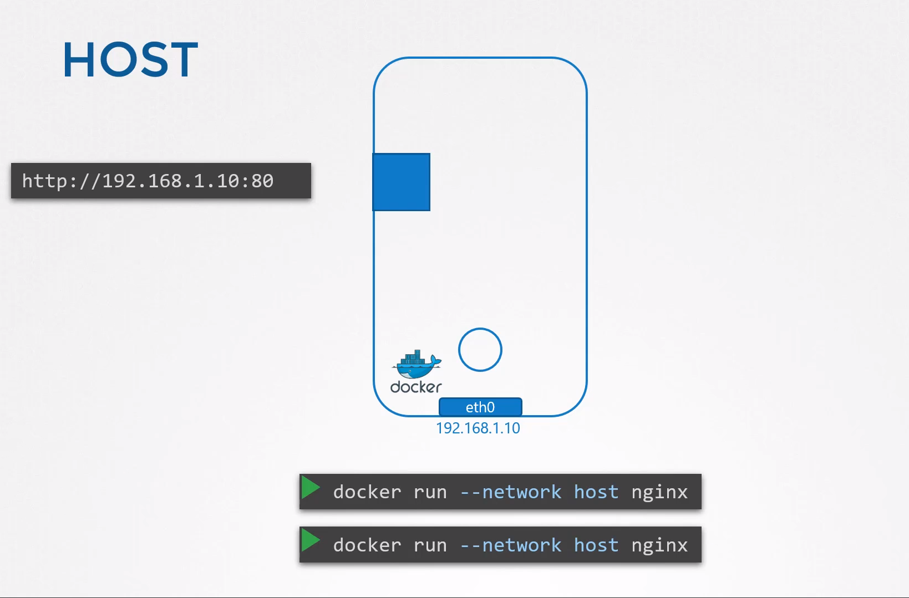
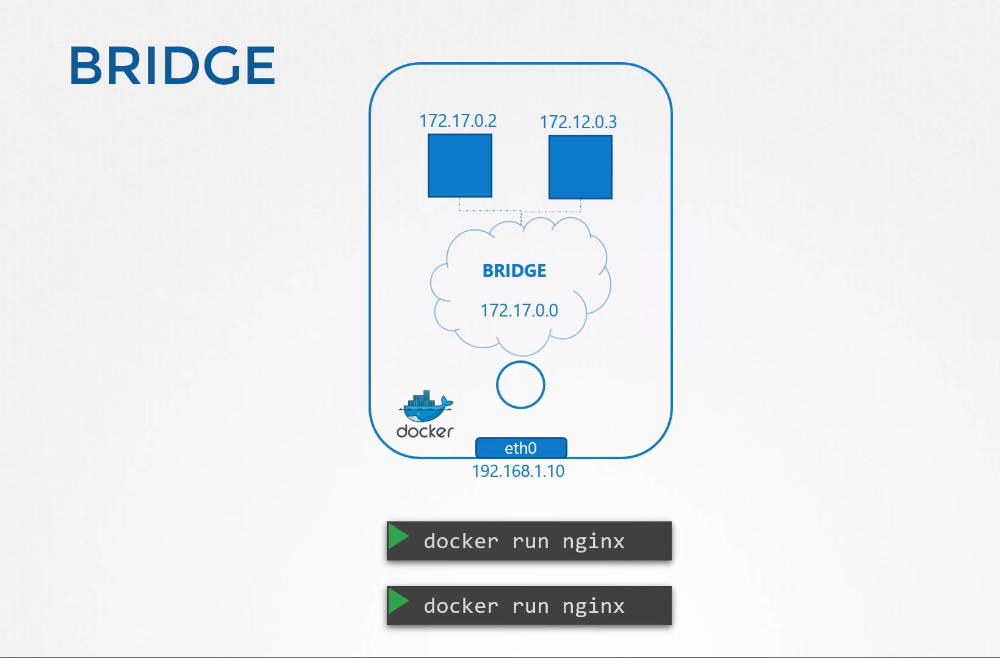
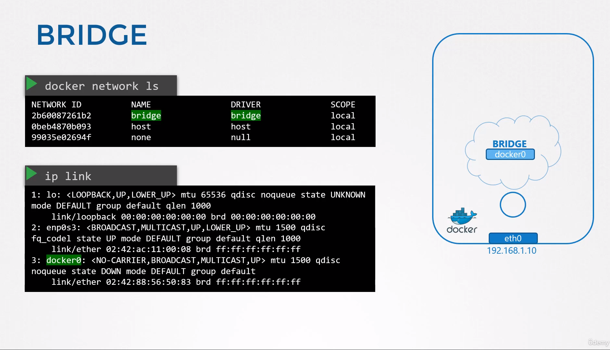
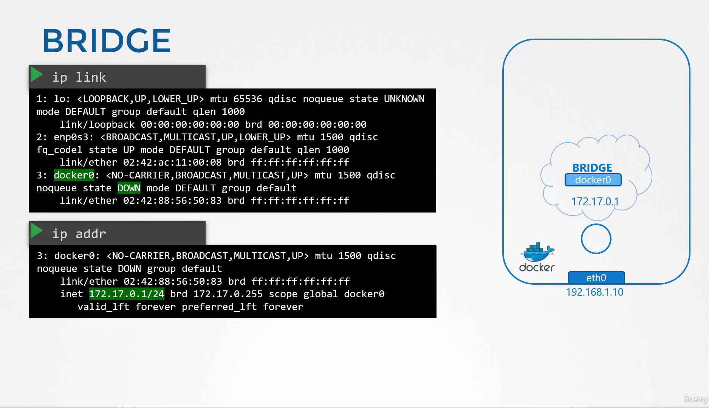
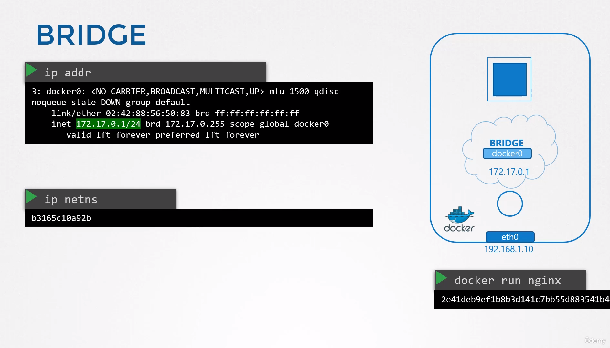
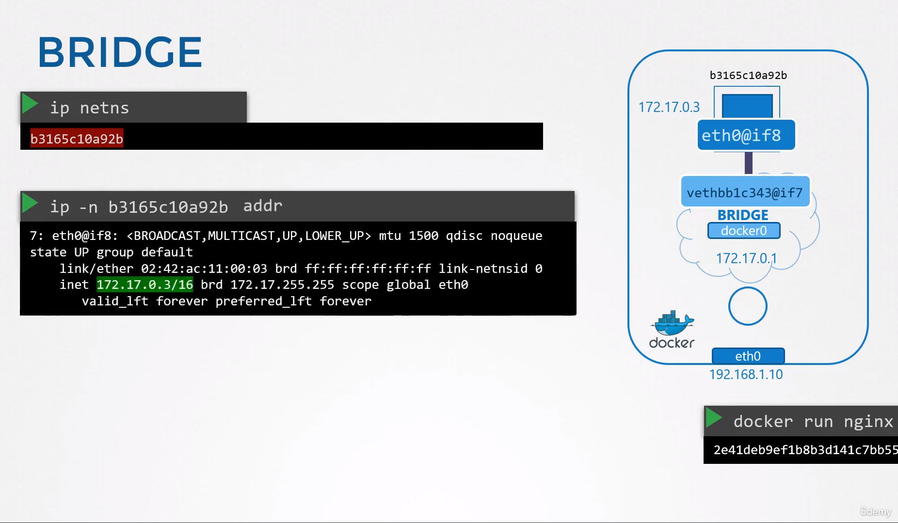
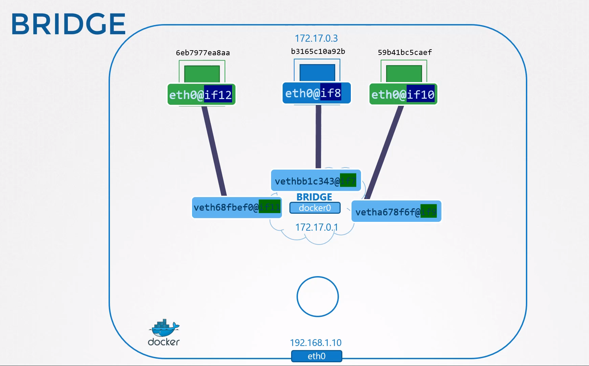
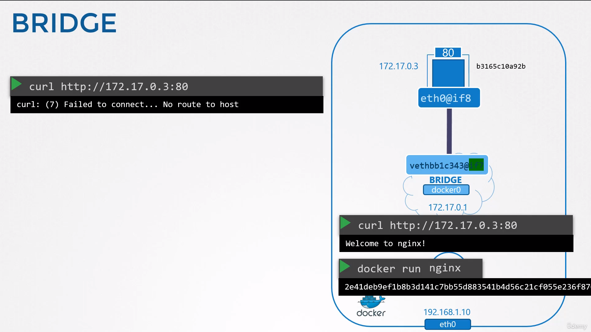
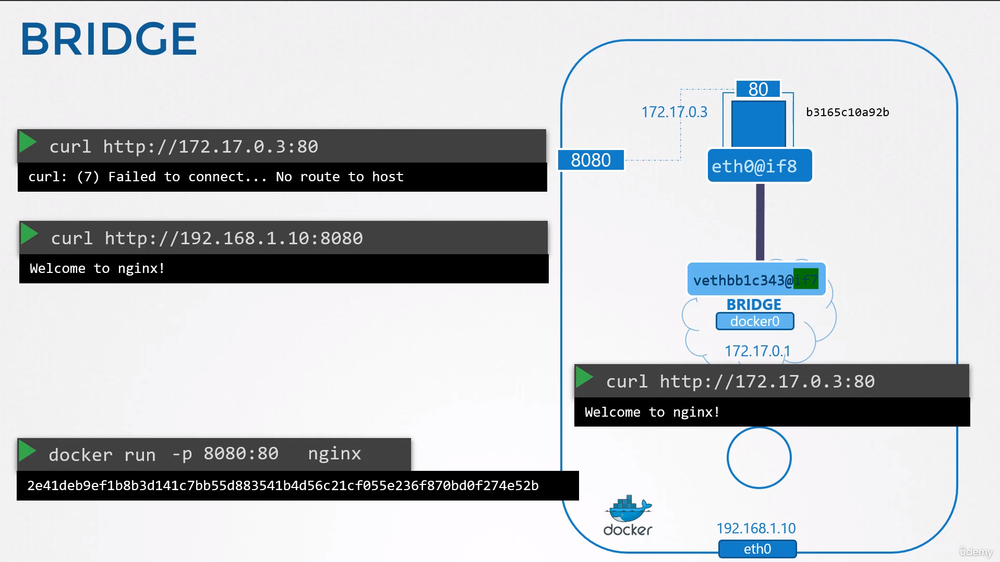

# Networking in Docker

- **Introduction to Docker Networking:**
  
  - Docker allows various networking options for containers.
  - This lecture focuses on basic networking options and relates them to networking namespaces.
- **Single Docker Host Setup:**
  
  - A Docker host is a server with Docker installed.
  - It has an internet interface at port 80 connecting to the local network with IP address 192.168.1.10.
- **Networking Options:**
  
  1. **None Network:**
     
     - Container isn't attached to any network.
     - No connectivity with the outside world or between containers.
     
     
  2. **Host Network:**
     
     - Container shares host network.
     - No network isolation between host and container.
     - Applications in containers are directly available on host ports.
     - Can't run multiple containers listening on the same port simultaneously.
     
     
  3. **Bridge Network:**
     
     - Creates an internal private network.
     - Default address: 172.17.0.0.
     - Each device gets a unique internal private network address.
     
     
- **Understanding Docker's Bridge Network:**
  
  - Docker creates an internal private network named "Bridge". To check :
    
    ```
    docker network ls
    ```
  - Docker calls the network by the name Bridge, but on the host, the network is created by the name `Docker0`. To check:
    
    ```
    ip link
    ```
    
    
  - Similar technique to namespaces using `IP link add` command with type set to bridge.
  - Remember, we said that the bridge network is like an interface to the host but a switch to the namespaces or containers within the host. So the interface docker0 on the host is assigned an IP 172.17.0.1.
    
  - Docker creates a network namespace for each container.
    
- **Container Attachment to Bridge Network:**
  
  - Docker attaches containers to the bridge network via a virtual cable with two interfaces.
  - One end attached to local bridge Docker0 on the host and another end within the container namespace.
  - Each container/network namespace gets an IP address within the network.
    
    
  - The same procedure is followed every time a new container is created. `Docker creates a namespace`, `creates a pair of interfaces`, `attaches one end to the container and another end to the bridge network`. The interface pairs can be identified using their numbers. Odd and even form a pair. 9 and 10 are one pair. 7 and 8 are another. 11 and 12 are one pair. The containers are all part of the network now. They can all communicate with each other.
    
    
- **Port Mapping:**
  
  - The container we created is Nginx, so it's a web application serving webpage on port 80. Since our container is within a private network inside the host, `only other containers in the same network, or the host itself, can access this webpage`. This means that only other containers in the same network or the host itself can access the services provided by the container.
  - However, if one tries to access the same webpage from outside the host, it will not be accessible.
    
  - To allow external users or systems to access the applications hosted on containers, Docker provides the option of `port publishing` or `port mapping`.
  - Port mapping enables the mapping of a port on the host to a port on the container, effectively allowing traffic from external sources to reach the services running within the container.
  - With port mapping, users can specify which port on the host should be mapped to which port on the container, enabling external access to the services provided by the container.
    
  - Mapping port 8080 on Docker host to port 80 on the container.
    
    ```
    $ docker run -itd --name nginx -p 8080(host):80(container) nginx
    e7387bbb2e2b6cc1d2096a080445a6b83f2faeb30be74c41741fe7891402f6b6
    ```
- **Forwarding Traffic:**
  
  - Docker forwards traffic from one port to another using NAT rules.
  - Utilizes IP tables to create NAT rules.
  - Adds rules to Docker chain to change destination port.
  - Docker rule includes the container's IP as well.
  - Inspect the docker container to view the IPAddress.
  
  ```
  $ docker inspect nginx | grep -w IPAddress
            "IPAddress": "172.18.0.6",
                    "IPAddress": "172.18.0.6",
  ```
  
  - Accessing web page with the `curl` command.
  
  ```
  $ curl --head  http://172.18.0.6:80
  HTTP/1.1 200 OK
  Server: nginx/1.19.2
  ```
  
  - Port Mapping to docker container
  
  ```
  $ docker run -itd --name nginx -p 8080:80 nginx
  e7387bbb2e2b6cc1d2096a080445a6b83f2faeb30be74c41741fe7891402f6b6
  ```
  
  - Inspecting docker container to view the assgined ports.
  
  ```
  $ docker inspect nginx | grep -w -A5 Ports
  
  "Ports": {
                "80/tcp": [
                    {
                        "HostIp": "0.0.0.0",
                        "HostPort": "8080"
                    }
  ```
  
  - To view the IP Addr of the host system
  
  ```
  $ ip a
  
  # Accessing nginx page with curl command
  
  $ curl --head http://192.168.10.11:8080
  HTTP/1.1 200 OK
  Server: nginx/1.19.2
  ```
  
  - Configuring **iptables nat** rules
  
  ```
  $ iptables \
         -t nat \
         -A PREROUTING \
         -j DNAT \
         --dport 8080 \
         --to-destination 80
  ```
  
  ```
  $ iptables \
      -t nat \
      -A DOCKER \
      -j DNAT \
      --dport 8080 \
      --to-destination 172.18.0.6:80
  ```

## List the Iptables rules

```
$ iptables -nvL -t nat
```

#### References docs

- https://docs.docker.com/network/
- https://linux.die.net/man/8/iptables
- https://linux.die.net/man/8/ip

