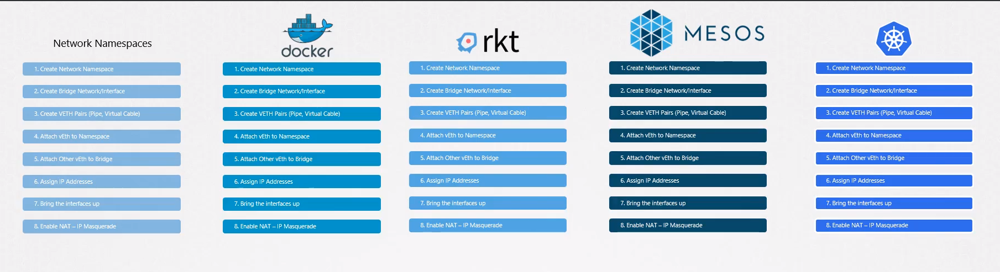
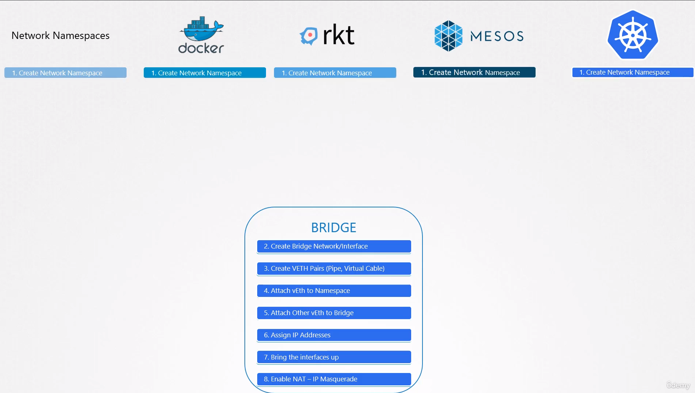
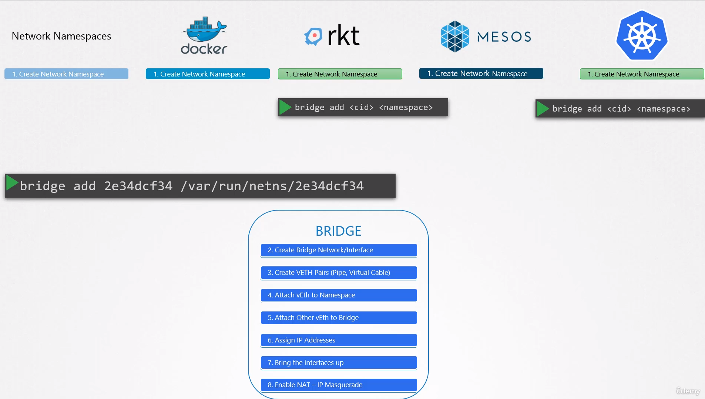
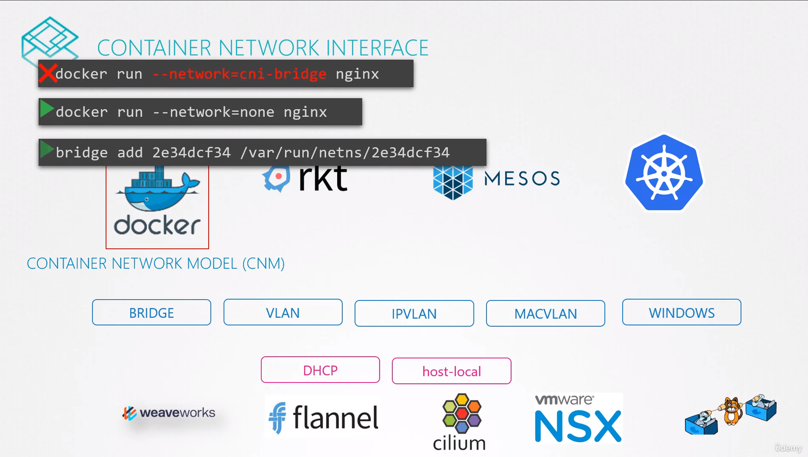

## Container Networking Interface (CNI)

### Traditional Container Networking Approach

- Previously, container solutions like Docker, Rocket, and Mesos each had their own way of configuring container networking.
  This involved:

  * Network Namespaces: Creating isolated network environments.
  * Bridge Networks: Connecting namespaces through a bridge.
  * Virtual Interfaces: Creating virtual cables with virtual interfaces on either end.
  * Attaching Interfaces: Attaching interfaces to namespaces and the bridge.
  * IP Assignment: Assigning IP addresses to interfaces and bringing them up.
  * NAT/IP Masquerade: Enabling external communication.
  
  

- But If we are all trying to solve the same networking challenges with our own little minor differences, why code and develop the same solution multiple times?
- This approach led to repetitive work across different container solutions.
- Why not just create a single standard approach that everyone can follow?

### CNI Standardization

- CNI addresses this redundancy by defining a standard for container network plugins.
- So we take all of these ideas from the different solutions and move all the networking portions of it into a single program or code. And since this is for the bridge network, we call it Bridge.
- So we have created a program or script that performs all the required tasks to get the container attached to a bridge network.
  
  
  **For example**:  You could run this program using its name bridge and specify that you want to add this container to a particular network namespace. The Bridge program takes care of the rest.
  
  ```
  bridge add 2e34dcf34 /var/run/netns/2e34dcf34
  ```
  
  **For example**: When Rocket or Kubernetes creates a new container, they call the Bridge Program and pass the container ID and namespace to get networking configured for that container.
  
- But how do you make sure the program you create will work currently with these run times? How do you know that container run times like Kubernetes or Rocket will invoke your program correctly? `That's where we need some standards defined`.
- A standard that defines how a program should look, how container run times will invoke them so that everyone can adhere to a single set of standards and develop solutions that work across run times. That's where container network interface comes in. The CNI is a set of standards that define how programs should be developed to solve networking challenges in a container runtime environments. `The programs are referred to as plugins`. In this case, `bridge` program that we have been referring to is a `plugin for CNI`.

---

Docker uses its own CNM (Container Network Model) standard, which is similar to CNI but with differences. This means CNI plugins don't directly integrate with Docker. However, workarounds exist, such as creating a Docker container without any network configuration

```
docker run --network=none nginx
```

and then manually invoking the CNI bridge plugin (like `Kubernetes` does).

```
bridge add 2e34dcf34 /var/run/netns/2e34dcf34
```


---

### Third-Party CNI Plugins

* Weave
* Flannel
* Cilium
* VMware NSX
* Calico
* Infoblox

