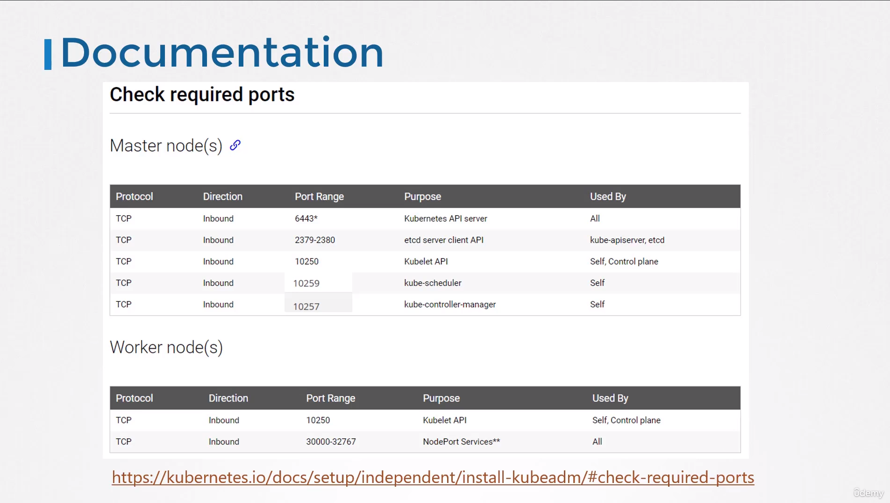

# Pre-requisite Cluster Networking

- Take me to [Lecture](https://kodekloud.com/topic/cluster-networking/)

In this section, we will take a look at **Pre-requisite of the Cluster Networking**

- Set the unique hostname.
- Get the IP addr of the system (master and worker node).
- Check the Ports.

## IP and Hostname

- To view the hostname

```
$ hostname
```

- To view the IP addr of the system

```
$ ip a
```

## Set the hostname

```
$ hostnamectl set-hostname <host-name>

$ exec bash
```

## View the Listening Ports of the system

```
$ netstat -nltp
```

## Ports to be Opened:

### Master Node:

- **API Server**: Port 6443 (Accessible for kube control tool, external users, and control plane components).
- **Kubelet**: Port 10250.
- **Kube Scheduler**: Port 10259.
- **Kube Controller Manager**: Port 10257.
- **ETCD Server**: Port 2379. Additional port 2380 required for ETCD client communication (for multiple master nodes).

### Worker Node:

- **Kubelet**: Port 10250.
- Worker nodes expose services for external access on ports 30000 to 32767.

  


#### References Docs

- https://kubernetes.io/docs/setup/production-environment/tools/kubeadm/install-kubeadm/#check-required-ports
- https://kubernetes.io/docs/concepts/cluster-administration/networking/

