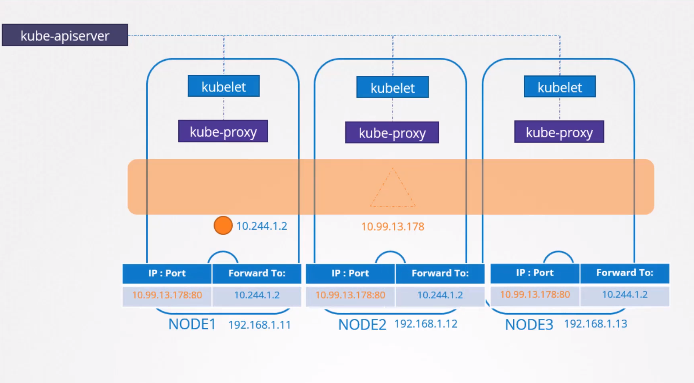
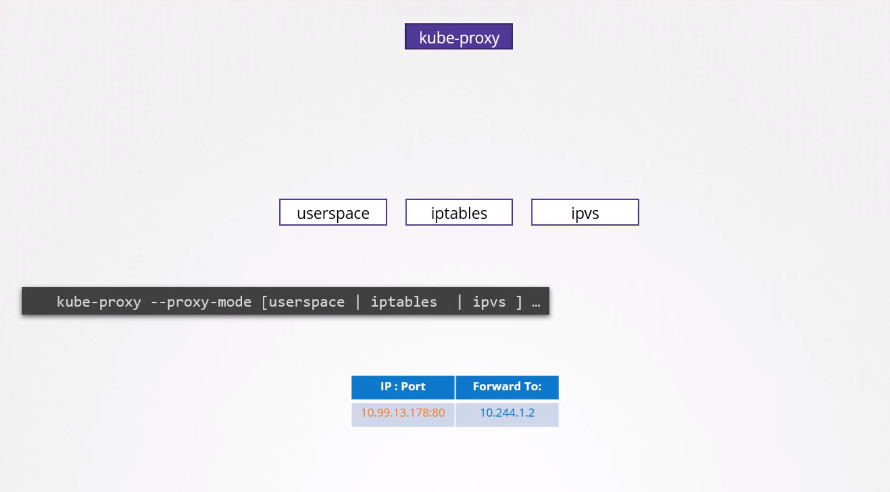

## Service Networking

### Pod Networking Recap

* We previously explored pod networking and learnt how bridge networks get created on each node.
* Pods are allocated a namespace with attached interfaces.
* `Pods receive IP addresses from a subnet assigned to their respective nodes`.
* Routes and otehr overlay techniques enable pods on various nodes to communicate, forming a large virtual network.

### Services vs. Pods for Communication

* You would rarely configure your pods to communicate directly with each others as the Pod's IP gets changed each time its freshly created.
* Services are the preferred approach for a pod to access services hosted on another pod.

### Service Types

* **ClusterIP:**
  * Used for the internal pod communication from within the cluster.
  * A service is assigned an IP address and a name.
  * Other pods can interact with it using the service IP or name.
* **NodePort:**
  * Exposes a pod externally.
  * The service acquires an IP address and exposes the application on a port across all nodes.
  * External users can access the service through this port on any node.

### Service Details

* Services are accessible from all pods within the cluster, independent of the pods' physical location on nodes.
* Services are virtual objects; they don't have servers or processes listening on their IP addresses.

### How Services Work

- We know that every Kubernetes node runs a `kubelet` process, which is responsible for creating pods. It then invokes the CNI plugin to configure networking for that pod.
- Similarly, each node runs another component known as `kube-proxy`. Kube-proxy watches the changes in the cluster through Kube API server, and every time a new service is to be created, kube-proxy gets into action.
- Whenever a Service object is created in Kubernetes, it is assigned an IP address from a predefined range. The kube-proxy components running on each node gets that IP address and creates forwarding rules on each node in the cluster.
  
  
- Saying, "Any traffic coming to this IP, the IP of the service, should go to the IP of the pod." Now, whenever a pod tries to reach the IP of the service, it is forwarded to the pod's IP address, which is accessible from any node in the cluster. Now, remember, it's not just the IP, it's an IP and port combination.
- Whenever services are created or deleted, the kube-proxy component creates or deletes these rules. So how are these rules created? kube-proxy supports different ways, such as userspace where kube-proxy listens on a port for each service and proxy's connections to the pods by creating IPVS rules. Or the third and the default option, and the one familiar to us is using iptables. The proxy mode can be set using the proxy mode option, while configuring the kube-proxy service. If this is not set, it defaults to iptables.
  
  

### Service IP Allocation

* The Kubernetes API server has a configurable service cluster IP range option (default: 10.0.0.0/24).
* This range is separate from the pod network CIDR range to prevent IP address conflicts.
* To check the Service Cluster IP Range:

  ```
  $ ps -aux | grep kube-apiserver
  --secure-port=6443 --service-account-key-file=/etc/kubernetes/pki/sa.pub --
  service-cluster-ip-range=10.96.0.0/12
  ```

### Viewing iptables Rules

1. Look for the service name within the IP tables' NAT table output.
2. Rules containing comments mentioning the service name indicate forwarding rules.

* Example rule: A DNAT rule to forward traffic to the pod's IP and port.

### NodePort Services

* For NodePort services, kube-proxy creates iptables rules to:
  * Forward incoming traffic on a specific port across all nodes.
  * Direct it to the corresponding backend pods.

### Verifying kube-proxy Logs

* Examine kube-proxy logs for details on the proxier used (e.g., iptables) and service creation events.
* The log file location may vary depending on your installation.
* Ensure the log verbosity level is set to view these entries.

# Service Networking

- Take me to [Lecture](https://kodekloud.com/topic/service-networking/)

In this section, we will take a look at **Service Networking**

## Service Types

- ClusterIP

```
clusterIP.yaml

apiVersion: v1
kind: Service
metadata:
  name: local-cluster
spec:
  ports:
  - port: 80
    targetPort: 80
  selector:
    app: nginx
```

- NodePort

```
nodeportIP.yaml

apiVersion: v1
kind: Service
metadata:
  name: nodeport-wide
spec:
  type: NodePort
  ports:
  - port: 80
    targetPort: 80
  selector:
    app: nginx
```

## To create the service

```
$ kubectl create -f clusterIP.yaml
service/local-cluster created

$ kubectl create -f nodeportIP.yaml
service/nodeport-wide created
```

## To get the Additional Information

```
$ kubectl get pods -o wide
NAME    READY   STATUS    RESTARTS   AGE   IP           NODE     NOMINATED NODE   READINESS GATES
nginx   1/1     Running   0          1m   10.244.1.3   node01   <none>           <no
```

## To get the Service

```
$ kubectl get service
NAME            TYPE        CLUSTER-IP      EXTERNAL-IP   PORT(S)        AGE
kubernetes      ClusterIP   10.96.0.1       <none>        443/TCP        5m22s
local-cluster   ClusterIP   10.101.67.139   <none>        80/TCP         3m
nodeport-wide   NodePort    10.102.29.204   <none>        80:30016/TCP   2m
```

## To check the Service Cluster IP Range

```
$ ps -aux | grep kube-apiserver
--secure-port=6443 --service-account-key-file=/etc/kubernetes/pki/sa.pub --
service-cluster-ip-range=10.96.0.0/12
```

## To check the rules created by kube-proxy in the iptables

```
$ iptables -L -t nat | grep local-cluster
KUBE-MARK-MASQ  all  --  10.244.1.3           anywhere             /* default/local-cluster: */
DNAT       tcp  --  anywhere             anywhere             /* default/local-cluster: */ tcp to:10.244.1.3:80
KUBE-MARK-MASQ  tcp  -- !10.244.0.0/16        10.101.67.139        /* default/local-cluster: cluster IP */ tcp dpt:http
KUBE-SVC-SDGXHD6P3SINP7QJ  tcp  --  anywhere             10.101.67.139        /* default/local-cluster: cluster IP */ tcp dpt:http
KUBE-SEP-GEKJR4UBUI5ONAYW  all  --  anywhere             anywhere             /* default/local-cluster: */
```

## To check the logs of kube-proxy

- May this file location is vary depends on your installation process.

```
$ cat /var/log/kube-proxy.log
```

#### References Docs

- https://kubernetes.io/docs/concepts/services-networking/service/

