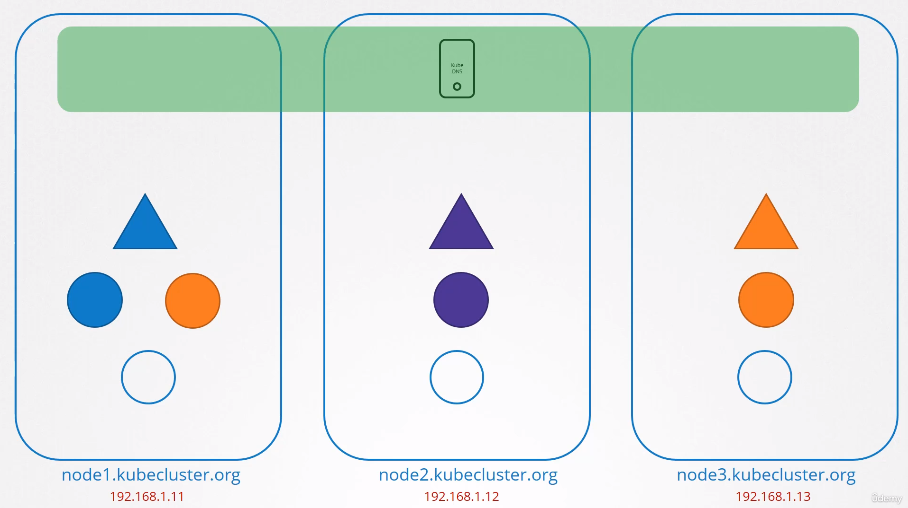
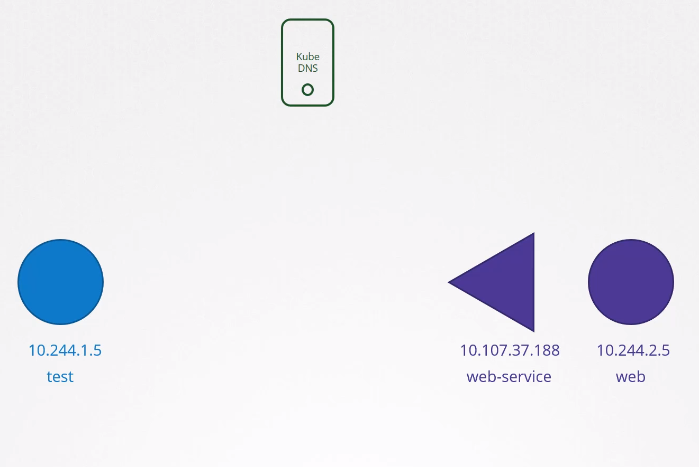
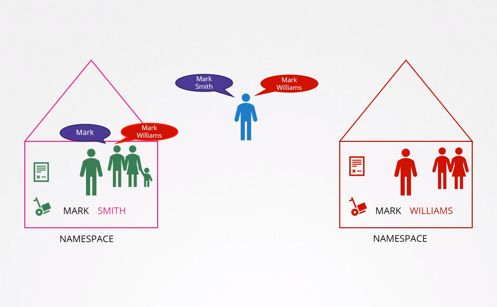
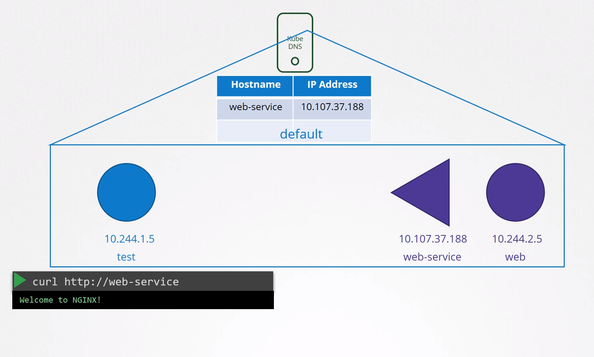
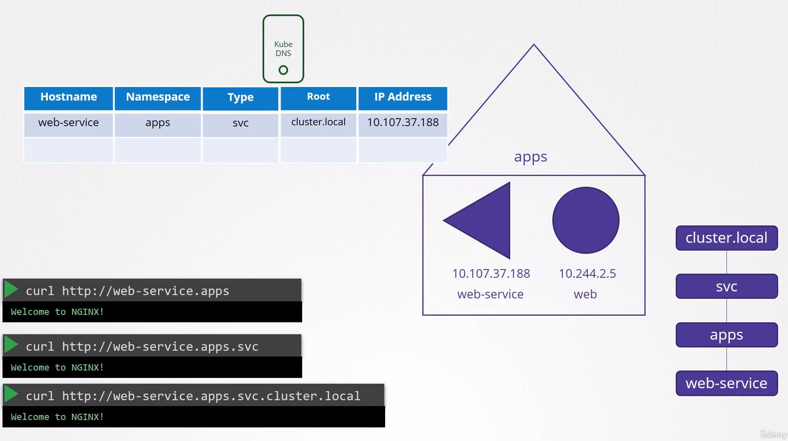
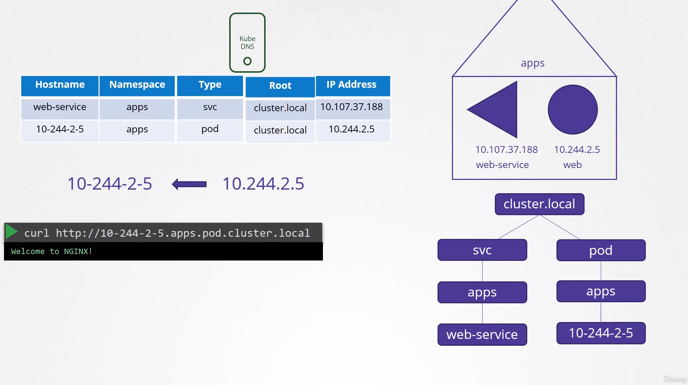
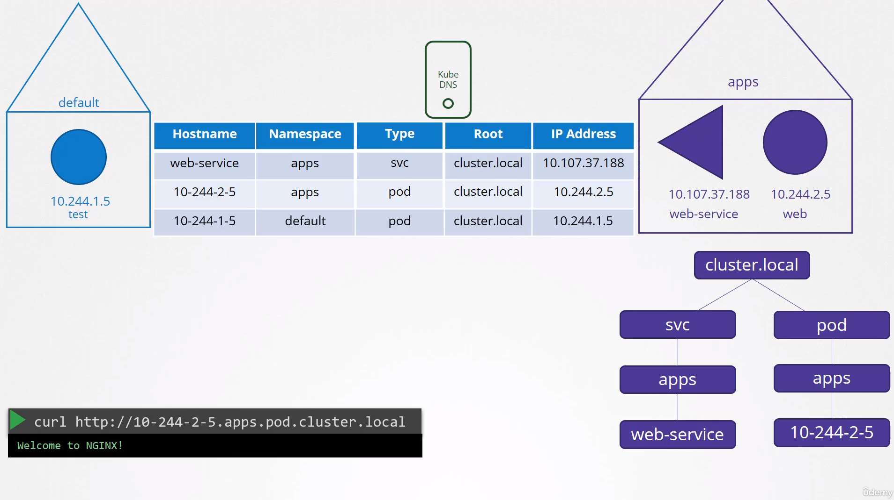

# Detailed Notes on DNS in Kubernetes Cluster

## Introduction to DNS in Kubernetes Cluster:

- DNS (Domain Name System) plays a crucial role in facilitating communication within a Kubernetes cluster.
- Understanding DNS prerequisites is essential, including knowledge of DNS tools like `host`, `nslookup`, `dig`, and various DNS record types.
- Core DNS is a tool used to set up a custom DNS server.

## Purpose of the Lecture:

- Discuss DNS resolution within the Kubernetes cluster, focusing on pods and services.
- Highlight the role of Kubernetes' built-in DNS server in facilitating communication between cluster components.
- Clarify that cluster networking setup, following best practices, ensures seamless communication among pods and services.

## Components Involved:

- The lecture involves a three-node Kubernetes cluster with deployed pods and services.
- Each node has a unique name and IP address registered in the organization's DNS server.
- DNS resolution within the cluster is the primary focus, disregarding external access and node management.

## Built-in DNS Server:

- Kubernetes automatically deploys a DNS server when setting up a cluster, simplifying DNS management.
- If you set up Kubernetes manually, then you need to do deploy a DNS server by yourself.
  
  

## DNS Resolution within the Cluster:

- Emphasizes communication between pods and services, overlooking node-level concerns.
- Assumes all pods and services can reach each other using their respective IP addresses.

## Service Creation and DNS Record Mapping:

- Let's start with just two pods and a service. I have a test pod on the left with the IP set to 10.2 44.105 and I have a web pod on the right with the IP set to 10.244.2.5. Looking at their I.P's, you can guess that they're probably hosted on two different nodes, but that doesn't really matter. As far as DNS is concerned, we assume that all pods and services can reach each other using their IP addresses. To make the web server accessible to the test pod, we create a service. We name it web service. The service gets an IP 10 10737.188.
  
- Whenever a service is created, the Kubernetes DNS service, creates a record for the service. It maps the service name to the IP address, so, within the cluster, any pod can now reach this service using its service name.
  
- Remember we talked about namespaces earlier, that everyone `within the namespace` address each other just with their `first names`, and to address anyone in `another namespace`, you use their `full names`.
  
  
  
- In this case, since the test pod and the web pod, and its associated service are all in the same namespace, the default name space, you were able to simply reach the web service from the test pod using just the service name web-service

### Let's assume the web-service is in a separate namespace named Apps.

- To refer to it from the `default namespace` you would have to say `web-service.apps`. The last name of the service, is now the name of the namespace. So here, web-service is the name of the service, and Apps, is the name of the namespace. For each namespace the DNS server creates a Sub domain.
- All the services are grouped together into another Sub Domain called `svc`. So you can reach your application, with the name webservice.apps.svc.
- Finally, all the services and pods are grouped together, into a `root domain` for the cluster, which is set to `cluster.local` by default. So you can access the service using the URL `webservice.apps.svc.cluster.local` and that's the `fully qualified domain name for the service`.
  
  

## Pod DNS Resolution:

- But what about pods?
- `Records for pods are not created by default, but we can enable that explicitly`. We will see that in the next lecture.
- Once enabled records are created for pods as well. It does not use the pod name though. For each pod, Kubernetes generates a name by replacing the dots in the IP address with dashes. The namespace remains the same and type is set to pod. The root domain is always `cluster.local`
  
  
- Similarly, the test pod in the default namespace gets a record in the DNS server with its IP converted to a `dash` hostname, 10-244-1-5 and namespace set to default. Type is pod and the route is cluster.local This results to the IP address of the pod.
  
  

## Pod DNS Record

The following DNS resolution:

```
<POD-IP-ADDRESS>.<namespace-name>.pod.cluster.local
```

> Example

```
# Pod is located in a default namespace

10-244-1-10.default.pod.cluster.local
```

```
# To create a namespace
$ kubectl create ns apps

# To create a Pod
$ kubectl run nginx --image=nginx --namespace apps

# To get the additional information of the Pod in the namespace "apps"
$ kubectl get po -n apps -owide
NAME    READY   STATUS    RESTARTS   AGE   IP           NODE     NOMINATED NODE   READINESS GATES
nginx   1/1     Running   0          99s   10.244.1.3   node01   <none>           <none>

# To get the dns record of the nginx Pod from the default namespace
$ kubectl run -it test --image=busybox:1.28 --rm --restart=Never -- nslookup 10-244-1-3.apps.pod.cluster.local
Server:    10.96.0.10
Address 1: 10.96.0.10 kube-dns.kube-system.svc.cluster.local

Name:      10-244-1-3.apps.pod.cluster.local
Address 1: 10.244.1.3
pod "test" deleted

# Accessing with curl command
$ kubectl run -it nginx-test --image=nginx --rm --restart=Never -- curl -Is http://10-244-1-3.apps.pod.cluster.local
HTTP/1.1 200 OK
Server: nginx/1.19.2
```

## Service DNS Record

- The following DNS resolution:

```
<service-name>.<namespace-name>.svc.cluster.local
```

> Example

```
# Service is located in a default namespace

web-service.default.svc.cluster.local
```

- Pod, Service is located in the `apps` namespace

```
# Expose the nginx Pod
$ kubectl expose pod nginx --name=nginx-service --port 80 --namespace apps
service/nginx-service exposed

# Get the nginx-service in the namespace "apps"
$ kubectl get svc -n apps
NAME            TYPE        CLUSTER-IP      EXTERNAL-IP   PORT(S)   AGE
nginx-service   ClusterIP   10.96.120.174   <none>        80/TCP    6s

# To get the dns record of the nginx-service from the default namespace
$ kubectl run -it test --image=busybox:1.28 --rm --restart=Never -- nslookup nginx-service.apps.svc.cluster.local
Server:    10.96.0.10
Address 1: 10.96.0.10 kube-dns.kube-system.svc.cluster.local

Name:      nginx-service.apps.svc.cluster.local
Address 1: 10.96.120.174 nginx-service.apps.svc.cluster.local
pod "test" deleted

# Accessing with curl command
$ kubectl run -it nginx-test --image=nginx --rm --restart=Never -- curl -Is http://nginx-service.apps.svc.cluster.local
HTTP/1.1 200 OK
Server: nginx/1.19.2
```

#### References Docs

- https://kubernetes.io/docs/concepts/services-networking/dns-pod-service/
- https://kubernetes.io/docs/tasks/administer-cluster/dns-debugging-resolution/

