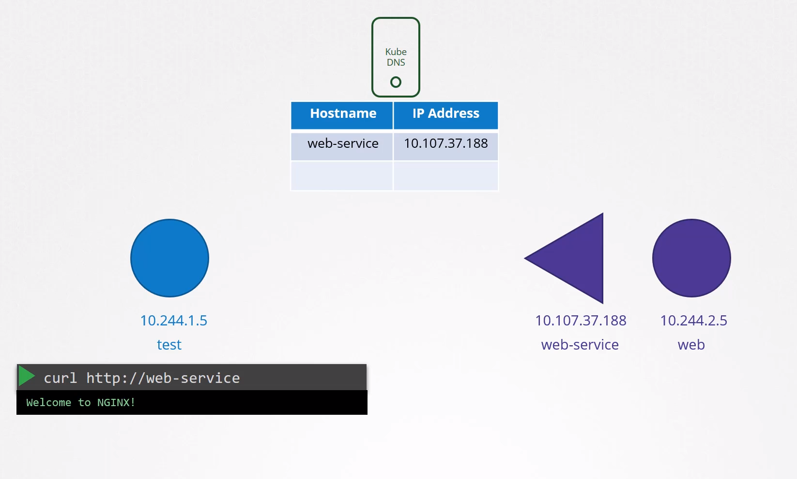

## CoreDNS Setup in Kubernetes:

- Kubernetes implements DNS by deploying a DNS server within the cluster.
- Before version 1.12, the DNS server was known as kube-dns. From version 1.12 onwards, CoreDNS is recommended.
- CoreDNS is deployed as a pod in the `kube-system` namespace as part of a replica set for redundancy.
- It runs the CoreDNS executable, requiring a configuration file named `Corefile` located at `/etc/coredns`.
- Configuration includes various plugins such as error handling, health reporting, metrics monitoring, and caching.
- The crucial plugin for Kubernetes integration is the kubernetes plugin, setting the top-level domain name as `cluster.local`.
  
  
- The `pods` option within the Kubernetes plugin handles creating records for pods in the cluster.
- DNS queries not resolved internally are forwarded to the nameserver specified in the CoreDNS pod's `/etc/resolv.conf`, typically set to the Kubernetes node's nameserver.
- The `Corefile` is passed to the pod as a config map object, allowing for configuration modifications via editing the config map object.
- CoreDNS/KubeDNS watches the Kubernetes cluster for new pods or services and adds records for them in its database upon creation.
  
  
- When CoreDNS is deployed within a Kubernetes cluster, it automatically creates a service to make itself available to other components within the cluster. By default, this service is named kube-dns.
- The IP address of the kube-dns service is configured as the nameserver on each pods. This configuration is handled automatically by Kubernetes, eliminating the need for manual configuration.
  
  
  
- Once the pods are configured with the right nameserver, you can now resolve other pod and services. You can access the web service using just web service or web-service.default or web-service.default.SVC or web-service.default.svc.cluster.local.

## Kubernetes Component Responsible for DNS Configuration on Pods

- The kubelet is the Kubernetes component responsible for automatically configuring DNS settings on pods. If you look at the config file of the kubelet, you will see the IP of the DNS server and domain in it and that's how it do it.
  
  

## DNS Configuration for Pods:

- Pods automatically point to the CoreDNS server for DNS resolution.
- Kubernetes automatically configures DNS settings on pods during creation.
- The kubelet is responsible for configuring DNS on pods.
- The kubelet's config file contains the DNS server's IP address and domain.
- With the correct nameserver configured, pods can resolve other pods and services within the cluster.

## Accessing Services via DNS:

- Services within the cluster are accessible using various DNS names.
- A service named `kube-dns` is created alongside the CoreDNS deployment, with its IP address configured as the nameserver for pods.
- DNS configurations on pods are automatically managed by Kubernetes.
- Pods can access services using various DNS names, including the fully qualified domain name (`FQDN`) and abbreviated forms.
- The `/etc/resolv.conf` file on pods includes search entries for different DNS names, allowing for flexible service access.
- However, accessing pods requires specifying the FQDN.

# CoreDNS in Kubernetes

- Take me to [Lecture](https://kodekloud.com/topic/coredns-in-kubernetes/)

In this section, we will take a look at **CoreDNS in the Kubernetes**

## To view the Pod

```
$ kubectl get pods -n kube-system
NAME                                      READY   STATUS    RESTARTS   AGE
coredns-66bff467f8-2vghh                  1/1     Running   0          53m
coredns-66bff467f8-t5nzm                  1/1     Running   0          53m
```

## To view the Deployment

```
$ kubectl get deployment -n kube-system
NAME                      READY   UP-TO-DATE   AVAILABLE   AGE
coredns                   2/2     2            2           53m
```

## To view the configmap of CoreDNS

```
$ kubectl get configmap -n kube-system
NAME                                 DATA   AGE
coredns                              1      52m
```

## CoreDNS Configuration File

```
$ kubectl describe cm coredns -n kube-system

Corefile:
---
.:53 {
    errors
    health {       lameduck 5s
    }
    ready
    kubernetes cluster.local in-addr.arpa ip6.arpa {
       pods insecure
       fallthrough in-addr.arpa ip6.arpa
       ttl 30
    }
    prometheus :9153
    forward . /etc/resolv.conf
    cache 30
    loop
    reload
}
```

## To view the Service

```
$ kubectl get service -n kube-system
NAME       TYPE        CLUSTER-IP   EXTERNAL-IP   PORT(S)                  AGE
kube-dns   ClusterIP   10.96.0.10   <none>        53/UDP,53/TCP,9153/TCP   62m
```

## To view Configuration into the kubelet

```
$ cat /var/lib/kubelet/config.yaml | grep -A2  clusterDNS
clusterDNS:
- 10.96.0.10
clusterDomain: cluster.local
```

## To view the fully qualified domain name

- With the `host` command, we will get fully qualified domain name (FQDN).

```
$ host web-service
web-service.default.svc.cluster.local has address 10.106.112.101

$ host web-service.default
web-service.default.svc.cluster.local has address 10.106.112.101

$ host web-service.default.svc
web-service.default.svc.cluster.local has address 10.106.112.101

$ host web-service.default.svc.cluster.local
web-service.default.svc.cluster.local has address 10.106.112.101
```

## To view the `/etc/resolv.conf` file

```
$ kubectl run -it --rm --restart=Never test-pod --image=busybox -- cat /etc/resolv.conf
nameserver 10.96.0.10
search default.svc.cluster.local svc.cluster.local cluster.local
options ndots:5
pod "test-pod" deleted
```

## Resolve the Pod

```
$ kubectl get pods -o wide
NAME      READY   STATUS    RESTARTS   AGE     IP           NODE     NOMINATED NODE   READINESS GATES
test-pod   1/1     Running   0          11m     10.244.1.3   node01   <none>           <none>
nginx      1/1     Running   0          10m     10.244.1.4   node01   <none>           <none>

$ kubectl exec -it test-pod -- nslookup 10-244-1-4.default.pod.cluster.local
Server:    10.96.0.10
Address 1: 10.96.0.10 kube-dns.kube-system.svc.cluster.local

Name:      10-244-1-4.default.pod.cluster.local
Address 1: 10.244.1.4
```

## Resolve the Service

```
$ kubectl get service
NAME          TYPE        CLUSTER-IP       EXTERNAL-IP   PORT(S)   AGE
kubernetes    ClusterIP   10.96.0.1        <none>        443/TCP   85m
web-service   ClusterIP   10.106.112.101   <none>        80/TCP    9m

$ kubectl exec -it test-pod -- nslookup web-service.default.svc.cluster.local
Server:    10.96.0.10
Address 1: 10.96.0.10 kube-dns.kube-system.svc.cluster.local

Name:      web-service.default.svc.cluster.local
Address 1: 10.106.112.101 web-service.default.svc.cluster.local
```

#### References Docs

- https://kubernetes.io/docs/concepts/services-networking/dns-pod-service/#services
- https://kubernetes.io/docs/concepts/services-networking/dns-pod-service/#pods

