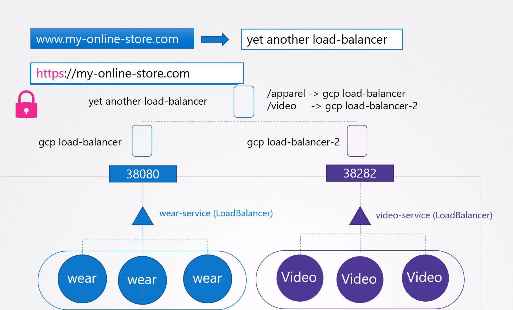

# Ingress

- We will start with a simple scenario.
- You are deploying an application on Kubernetes for a company that has an online store selling products. Your application would be available at say, myonlinestore.com. You build the application into a docker image and deploy it on the Kubernetes cluster as a pod in a deployment. Your application needs a database so you deploy a My SQL database as a pod and create a service of type cluster IP called my SQL Service to make it accessible to your application. Your application is now working. To make the application accessible to the outside world, you create another service, this time of type node port, and make your application available on a high port on the nodes in the cluster.
  
- In this example, a port 38080, is allocated for the service. The users can now access your application using the URL HTTP://< IP of any of your nodes >, followed by the port 38080.
- That setup works and users are able to access the application. Whenever traffic increases, we increase the number of replicas of the pod to handle the additional traffic, and the service takes care of splitting traffic between the pods.
- __However, if you have deployed a production grade application before you know that there are many more things involved in addition to simply splitting the traffic between the pods.__
- For example, we do not want the users to have to type in IP address every time. So you configure your DNS server to point to the IP of the nodes.
  
  
- Your users can now access your application using the URL myonlinestore.com and port 38080.
- Now, you don't want your users to have to remember a port number either.
- However, service node ports can only allocate high numbered ports, which are greater than 30,000.
- So you then bring in an additional layer between the DNS server and your cluster, like a `proxy server that proxies requests on port 80 to port 38080 on your nodes`.
  
- You then point your DNS to this server and users can now access your application by simply visiting myonlinestore.com without having to type any port.
- __Now this is if your application is hosted on-prem in your data center. Let's take a step back and see what you could do if you were on a public cloud environment like Google Cloud Platform or AWS.__
- In that case, instead of creating a service of type node port for your wear application, you could set it to type `LoadBalancer`.
  
  
- When you do that, Kubernetes would still do everything that it has to do for a node port, which is to provision a high port for the service. But in addition to that, Kubernetes also sends a request to Google Cloud Platform to provision a network load balancer for the service.
- On receiving the request, GCP would then automatically deploy a load balancer configured to route traffic to the service ports on all the nodes and return its information to Kubernetes.
- The load balancer has an external IP that can be provided to users to access the application. In this case, we set the DNS to point to this IP and users access the application using the URL myonlinestore.com.
  
  
- __Your company's business grows and you now have new services for your customers. For example, a video streaming service. You want your users to be able to access your new video streaming service by going to myonlinestore.com/watch. You'd like to make your old application accessible at myonlinestore.com/wear.__
- Your developers developed the new video streaming application as a completely different application as it has nothing to do with the existing one. However, in order to share the same cluster resources, you deploy the new application as a separate deployment within the same cluster.
- You create a service called video service of type load balancer. Kubernetes provisions port 38282 for this service, and also provisions a network load balancer on the cloud. The new load balancer has a new IP.
  
  
- *Remember, you must pay for each of these load balancers and having many such load balancers can inversely affect your cloud bill.*
- So how do you direct traffic between each of these load balancers based on the URL that the users type in?
- You need yet another proxy or load balancer that can redirect traffic based on URLs to the different services.
  
  
  
  ---
  
  - Every time you introduce a new service, you have to reconfigure the load balancer. And finally, you also need to enable SSL for your applications so your users can access your application using HTTPS.
    
    
  - But where do you configure that?
  - It can be done at different levels, either at the application level itself or at the load balancer or proxy server level. But which one?
  - You don't want your developers to implement it in their application as they would do it in different ways. You want it to be configured in one place with minimal maintenance. Now, that's a lot of different configuration and all of this becomes difficult to manage when your application scales. It requires involving different individuals in different teams.
  - You need to configure your firewall rules for each new service, and it's expensive as well as for each service, a new cloud native load balancer needs to be provisioned.
  - Wouldn't it be nice if you could manage all of that within the Kubernetes cluster and have all that configuration as just another Kubernetes definition file that lives along with the rest of your application deployment files?
  
  ---
- That's where ingress comes in.
- Ingress helps your users access your application using a single externally accessible URL that you can configure to route to different services within your cluster based on the URL path. At the same time, implement SSL security as well.
  
  
- Simply think of ingress as a layer seven load balancer built in to the Kubernetes cluster that can be configured using native Kubernetes primitives just like any other object in Kubernetes. Now remember, `even with ingress, you still need to expose it to make it accessible outside the cluster`. So you still have to either publish it as a node port or with a cloud native load balancer, but that is just a one-time configuration.
  
- Going forward, you're going to perform all your load balancing authentication, SSL and URL-based routing configurations on the ingress controller.
- So how does it work? What is it? Where is it? How can you see it? How can you configure it? How does it load balance? How does it implement SSL?
- `Without ingress, how would you do all of this?`
  
- I would use a reverse proxy or a load balancing solution like NGINX or HA Proxy or Traefik.
- Then, I would deploy them on a Kubernetes cluster and configure them to route traffic to other services. The configuration involves defining URL routes, configuring SSL certificates, etc. Ingress is implemented by Kubernetes in kind of the same way.
- The solution you deploy is called as an `Ingress controller`, and the set of rules you configure are called as `Ingress resources`.

  

- Now remember, a Kubernetes cluster does not come with an ingress controller by default, so you must deploy one.
- What do you deploy? There are a number of solutions available for ingress, a few of them being G-C-E, which is Google's layer seven HTTP load balancer, NGINX, Contour, HA Proxy, Traefik and Istio. Out of this, GCE and NGINX are currently being supported and maintained by the Kubernetes project, and in this lecture we will use NGINX as an example.
- These ingress controllers are not just another load balancer or NGINX server. The ingress controllers have additional intelligence built into them to monitor the Kubernetes cluster for new definitions or ingress resources and configure the N-G-I-N-X server accordingly. An N-G-I-N-X controller is deployed as just another deployment in Kubernetes. So we start with a deployment definition file named N-G-I-N-X ingress controller with one replica and a simple pod definition template.

In this section, we will take a look at **Ingress**

- Ingress Controller
- Ingress Resources

## Ingress Controller

- Deployment of **Ingress Controller**

## ConfigMap

```
kind: ConfigMap
apiVersion: v1
metadata:
  name: nginx-configuration
```

## Deployment

```
apiVersion: apps/v1
kind: Deployment
metadata:
  name: ingress-controller
spec:
  replicas: 1
  selector:
    matchLabels:
      name: nginx-ingress
  template:
    metadata:
      labels:
        name: nginx-ingress
    spec:
      serviceAccountName: ingress-serviceaccount
      containers:
        - name: nginx-ingress-controller
          image: quay.io/kubernetes-ingress-controller/nginx-ingress-controller:0.21.0
          args:
            - /nginx-ingress-controller
            - --configmap=$(POD_NAMESPACE)/nginx-configuration
          env:
            - name: POD_NAME
              valueFrom:
                fieldRef:
                  fieldPath: metadata.name
            - name: POD_NAMESPACE
              valueFrom:
                fieldRef:
                  fieldPath: metadata.namespace
          ports:
            - name: http
              containerPort: 80
            - name: https
              containerPort: 443
```

## ServiceAccount

- ServiceAccount require for authentication purposes along with correct Roles, ClusterRoles and RoleBindings.
- Create a ingress service account

```
$ kubectl create -f ingress-sa.yaml
serviceaccount/ingress-serviceaccount created
```

## Service Type - NodePort

```
# service-Nodeport.yaml

apiVersion: v1
kind: Service
metadata:
  name: ingress
spec:
  type: NodePort
  ports:
  - port: 80
    targetPort: 80
    protocol: TCP
    name: http
  - port: 443
    targetPort: 443
    protocol: TCP
    name: https
  selector:
    name: nginx-ingress
```

- Create a service

```
$ kubectl create -f service-Nodeport.yaml
```

- To get the service

```
$ kubectl get service
```

## Ingress Resources

```
Ingress-wear.yaml

apiVersion: extensions/v1beta1
kind: Ingress
metadata:
  name: ingress-wear
spec:
     backend:
        serviceName: wear-service
        servicePort: 80
```

- To create the ingress resource

```
$ kubectl create -f Ingress-wear.yaml
ingress.extensions/ingress-wear created
```

- To get the ingress

```
$ kubectl get ingress
NAME           CLASS    HOSTS   ADDRESS   PORTS   AGE
ingress-wear   <none>   *                 80      18s
```

## Ingress Resource - Rules

- 1 Rule and 2 Paths.

```
apiVersion: extensions/v1beta1
kind: Ingress
metadata:
  name: ingress-wear-watch
spec:
  rules:
  - http:
      paths:
      - path: /wear
        backend:
          serviceName: wear-service
          servicePort: 80
      - path: /watch
        backend:
          serviceName: watch-service
          servicePort: 80
```

- Describe the earlier created ingress resource

```
$ kubectl describe ingress ingress-wear-watch
Name:             ingress-wear-watch
Namespace:        default
Address:
Default backend:  default-http-backend:80 (<none>)
Rules:
  Host        Path  Backends
  ----        ----  --------
  *
              /wear    wear-service:80 (<none>)
              /watch   watch-service:80 (<none>)
Annotations:  <none>
Events:
  Type    Reason  Age   From                      Message
  ----    ------  ----  ----                      -------
  Normal  CREATE  23s   nginx-ingress-controller  Ingress default/ingress-wear-watch
```

- 2 Rules and 1 Path each.

```
# Ingress-wear-watch.yaml

apiVersion: extensions/v1beta1
kind: Ingress
metadata:
  name: ingress-wear-watch
spec:
  rules:
  - host: wear.my-online-store.com
    http:
      paths:
      - backend:
          serviceName: wear-service
          servicePort: 80
  - host: watch.my-online-store.com
    http:
      paths:
      - backend:
          serviceName: watch-service
          servicePort: 80
```

# Why Ingress Came into Picture?

Ingress controllers were introduced to address certain limitations and drawbacks of using NodePort or other types of services directly in Kubernetes.

Here are some reasons why Ingress came into the picture:

1. **HTTP/HTTPS Load Balancing**: In Kubernetes, NodePort services can expose applications to the internet, but they often lack features for HTTP/HTTPS load balancing and routing. Ingress controllers provide more advanced routing capabilities, allowing you to route traffic based on URL paths, domain names, headers, etc.
2. **Single Point of Entry**: Ingress controllers allow you to define a single point of entry for multiple services. This is useful for managing multiple applications or microservices within a Kubernetes cluster, providing a more centralized and organized approach to exposing services.
3. **TLS Termination**: While NodePort services can be secured using TLS, managing SSL certificates and termination can be cumbersome. Ingress controllers provide built-in support for TLS termination, simplifying the management of secure connections to your services.
4. **Path-Based Routing**: Ingress controllers allow you to route traffic based on URL paths, enabling more granular control over how requests are directed to different services within your cluster. This is particularly useful for applications with multiple endpoints or APIs.
5. **Dynamic Configuration**: Ingress controllers support dynamic configuration updates, allowing you to modify routing rules and settings without requiring changes to underlying Kubernetes resources. This flexibility makes it easier to adapt to changing requirements and traffic patterns.
6. **Integration with Kubernetes Ecosystem**: Ingress controllers are integrated with the Kubernetes ecosystem, leveraging native resources such as Ingress objects to define routing rules and configurations. This tight integration simplifies deployment and management within Kubernetes environments.

While NodePort services can be used to expose applications externally, they may not provide the same level of flexibility, scalability, and management features as Ingress controllers. Ingress controllers offer a more sophisticated solution for managing inbound traffic to your Kubernetes cluster, especially in production environments with complex routing requirements.

#### References Docs

- https://kubernetes.io/docs/concepts/services-networking/ingress/
- https://kubernetes.io/docs/concepts/services-networking/ingress-controllers/
- https://thenewstack.io/kubernetes-ingress-for-beginners/

