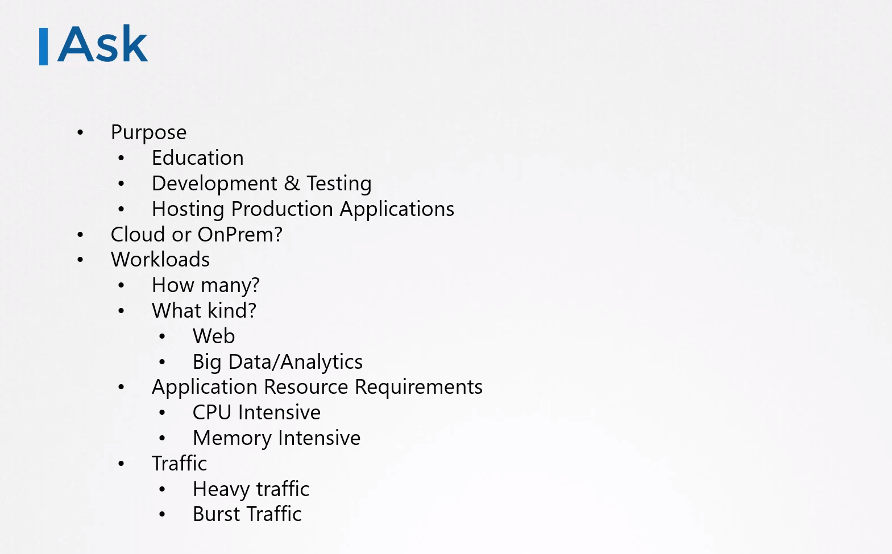
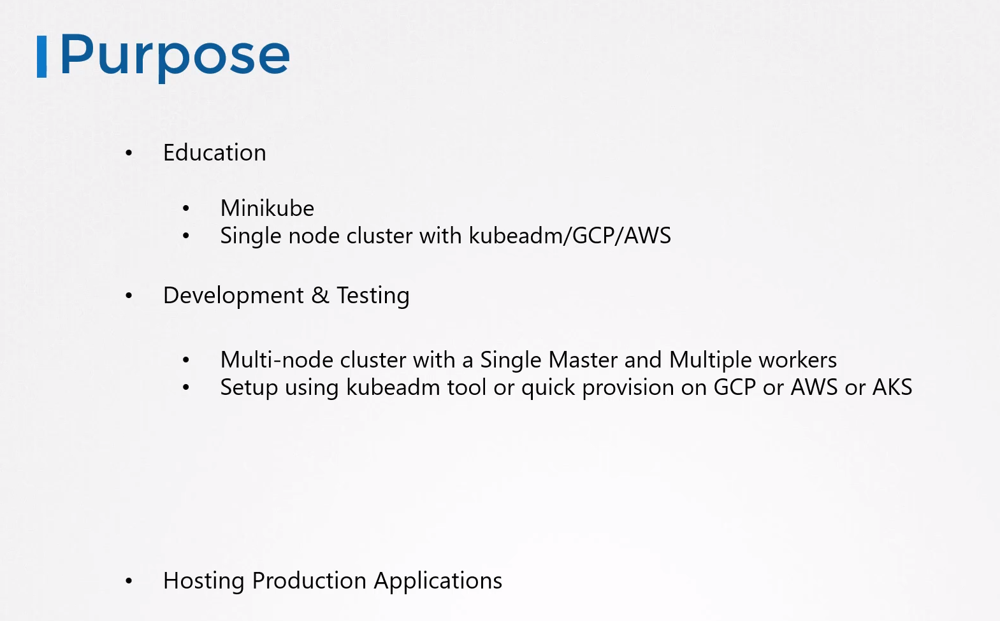
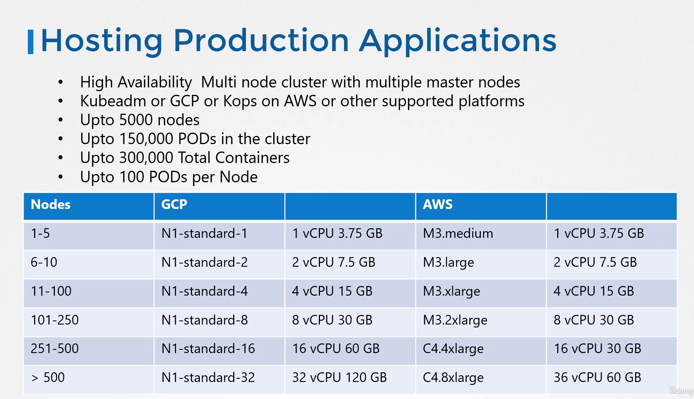
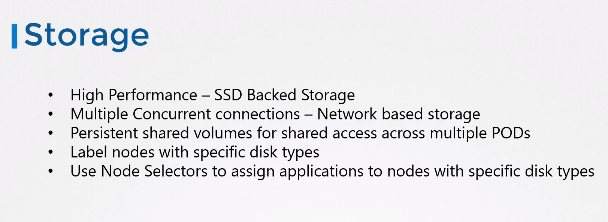

## Designing a Kubernetes Cluster

This lecture discussed important considerations for designing a Kubernetes cluster.
Here's a breakdown of the key points:

## **Before you design:**

* **Purpose:** Identify the cluster's purpose (learning, development, testing, or production).
* **Cloud Adoption:** Decide if you'll use a managed cloud platform or self-host the cluster.
* **Workload:** Consider the type of workloads the cluster will handle (web applications, big data, etc.) and their resource requirements.
* **Network Traffic:** Understand the expected network traffic patterns (continuous heavy traffic or bursts).
  
  

## **Cluster Options:**

* **Education/Learning:**
  
  * Minikube: A single-node cluster for learning purposes.
  * Single-node cluster with kubeadm: Deployable on local VMs or cloud providers (GCP, AWS).
* **Development/Testing:**
  
  * Multi-node cluster: One master node and multiple worker nodes for development and testing.
  * Managed cloud platforms: Google Kubernetes Engine (GKE) on GCP, Amazon Kubernetes Service (AKS) on Azure, and similar services on other providers.
  
  
* **Production:**
  
  * Highly available multi-node cluster: Multiple master nodes for redundancy and fault tolerance.
  * Deployment options: kubeadm (self-hosted), GKE (GCP), AWS using kOps, or other supported platforms.
  * Scalability: Up to 5,000 nodes, 150,000 pods, 300,000 containers per cluster, and 100 pods per node.
  * Cloud providers: Automatically selects node sizes based on cluster size.
  
  
* On-premises/Cloud:
  
  * Use kubeadm tool for on prem
  * GKE for GCP
  * Kops for AWS
  * AKS for Azure

## **Node Considerations:**

* **Physical vs. Virtual:** Nodes can be physical machines, virtual machines, or cloud instances.
* **Storage:**
  * High-performance workloads: Use SSD-backed storage.
  * Multiple concurrent access: Consider network-based storage.
  * Shared access across pods: Use persistent storage volumes.
  * Storage classes: Define different storage classes and allocate them based on application needs.
    
   

## **Master vs. Worker Nodes:**

* **Master:** Hosts control plane components (API server, scheduler, etc.).
* **Worker:** Hosts containerized workloads (pods).
* **Best Practice:**
  * Dedicate master nodes for control plane components only, especially in production (kubeadm can enforce this).
  * In large clusters, consider separating the etcd cluster from master nodes into its own cluster for high availability.

