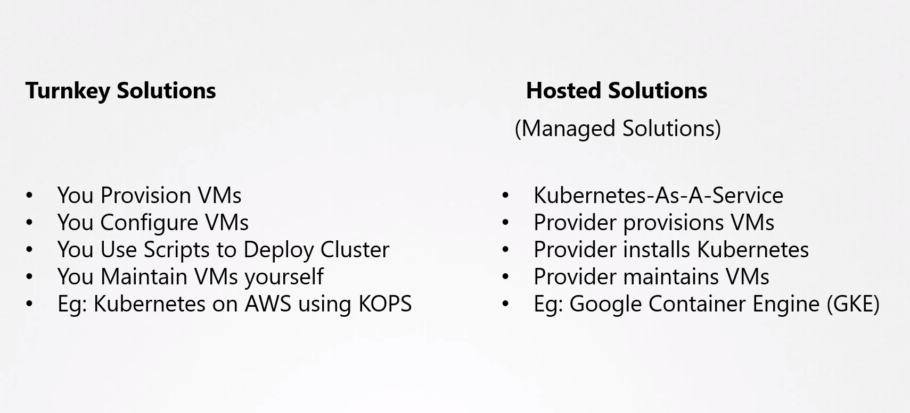

# Choosing a Kubernetes Infrastructure

## Kubernetes Cluster Deployment Options

- Kubernetes can be deployed on various systems in different ways, starting with your laptops to physical or virtual servers within your organization as well as those in the cloud. Depending on your requirements, your cloud ecosystem, and the kind of applications you wish to deploy, you may choose one of these solutions.

### Local Deployments

* **Suitable for:** Learning, testing, and development.
* **Deployment options:**
  * For Linux:
    * **Manual setup (tedious):** Installing binaries and setting up a local cluster manually on a supported Linux machine.
  * For Windows:
    * You cannot set up Kubernetes natively as there are no Windows binaries.
    * Use  **Virtualization softwares** like Hyper-V, VMware Workstation, or VirtualBox to create Linux VMs.
    * Run Kubernetes within these VMs.
    * There are also solutions available to run Kubernetes components as Docker containers on Windows VMs. But remember, even then, the Docker images are Linux based, and under the hoods, they're run on a small Linux OS created by HyperV for running Linux Docker containers.
  * **Minikube:** Easy, single-node cluster deployment using a virtualization tool like Oracle VirtualBox.
  * **Kubeadm tool:** Deploy single or multi-node clusters. Requires manual VM provisioning with supported configurations.

**Key takeaway:** Local deployments are ideal for learning and experimenting but not recommended for production use.

### Cloud Deployments

* **Suitable for:** Production environments.
* **Deployment options:**
  * **Turnkey solutions:** User provisions VMs and configures Kubernetes cluster using tools/scripts. Requires VM maintenance (patching, upgrades).
    * Example: Deploying a Kubernetes cluster on AWS using the KOPS tool.
  * **Hosted solutions (Kubernetes as a Service - KaaS):** Provider deploys and configures the entire cluster (VMs and Kubernetes). User has minimal management responsibilities.
    * Examples: Google Container Engine (GKE) on Google Cloud Platform (GCP), Azure Kubernetes Service (AKS) on Microsoft Azure, Amazon Elastic Container Service for Kubernetes (EKS) on Amazon Web Services (AWS).
    
    

**Key takeaway:** Cloud deployments offer scalability, reliability, and reduced management overhead compared to local deployments.

