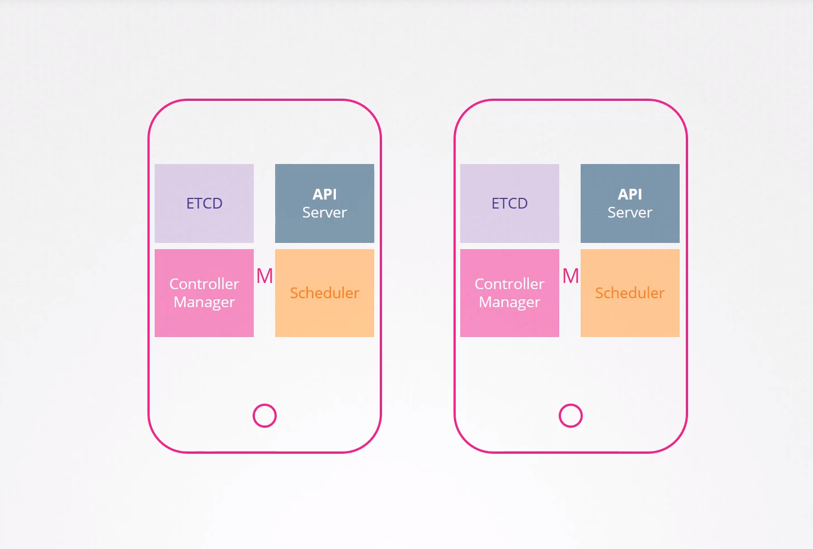
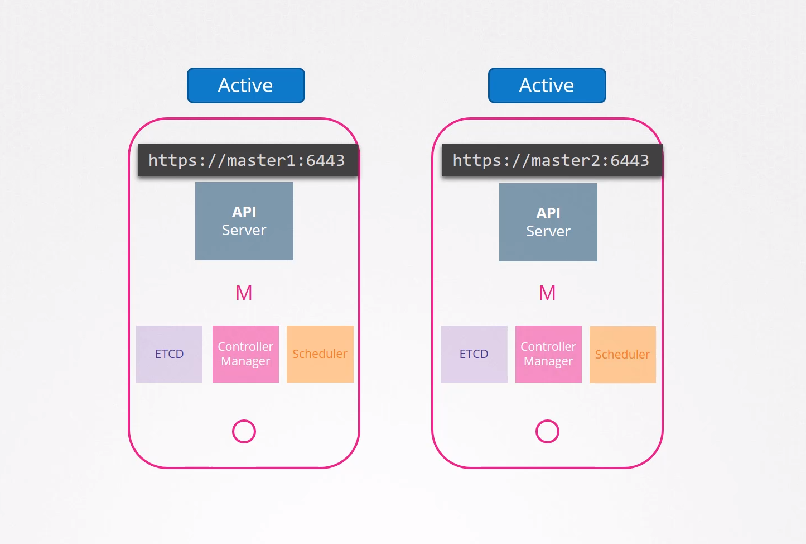
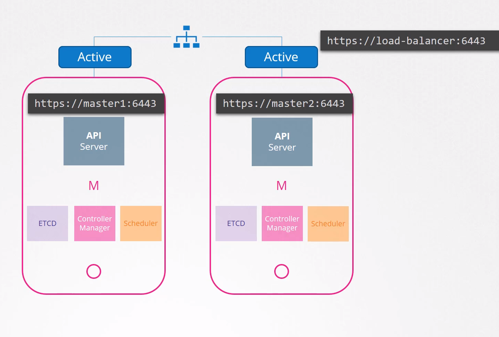
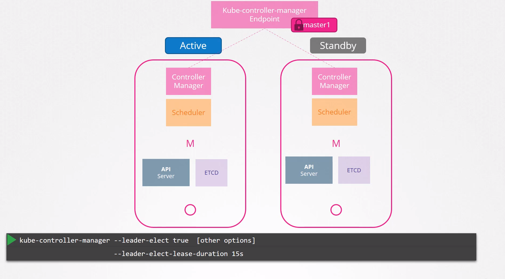
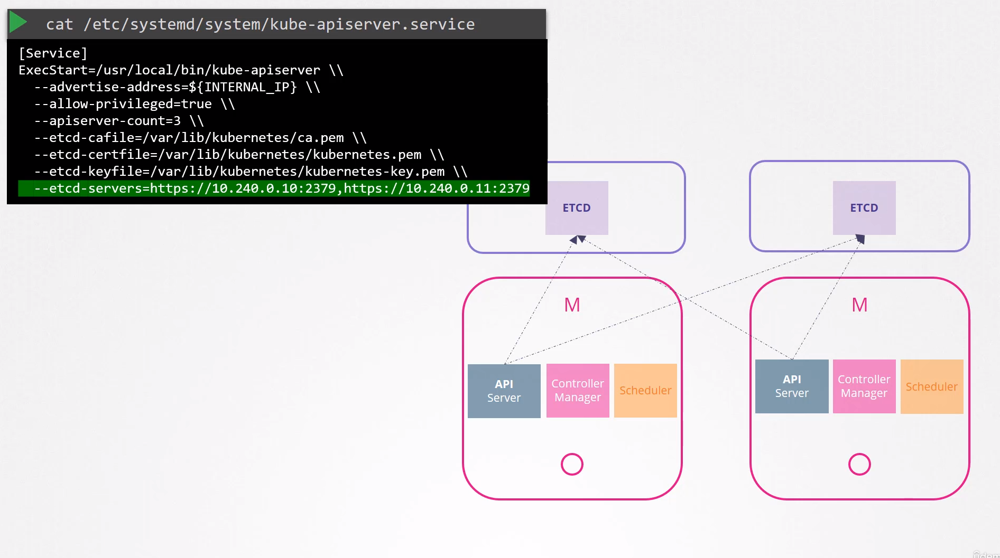

# Choosing High Availability in Kubernetes

## Introduction

- **High Availability (HA)** ensures that applications remain operational even during failures within the Kubernetes cluster.
- Losing the master node can disrupt services without proper HA measures.
- Workers and containers may continue functioning, but critical components like replication controllers and schedulers rely on the master for management.

## Components of the Master Node

- The master node hosts control plane components:
  - API server
  - Controller manager
  - Scheduler, and
  - Etcd server.
- These components manage the cluster, handle requests, schedule pods, and maintain cluster state.

## HA Configuration

- HA setup includes redundancy across all critical components: master nodes, worker nodes, control plane, and application replicas.
- In an HA setup with an additional master node, the same components run on the new master as well.
  
  
- So how does that work, running multiple instances of the same components, are they going to do the same thing twice? How do they share the work among themselves?

## Multiple Instances of Control Plane Components

- Each master node runs identical instances of control plane components.
- Instances collaborate to maintain cluster functionality and resilience.

## Active-Active Mode for API Servers

- The API servers on all master nodes can operate simultaneously in an active-active mode. This means they are all capable of handling requests concurrently. For example, when a user submits a request to create a new pod or deploy an application, any of the API servers can process the request.
- We know that the kubectl utility talks to the API server to get things done. We point the kubectl utility to reach the master node at port 6443. That's where the API server listens, and this is configured in the kube-config file.
- Well now with two masters where do we point the kubectl to? We can send the request to either one of them, but we shouldn't be sending the same request to both.
  
  
- So it is better to have a load balancer of some kind configured in the front of the master nodes that split traffic between the API servers. We then point the kubectl utility to that load balancer. You may use NGINX or HA proxy or any other load balancer for this purpose.
  
  
- By configuring a load balancer in front of the master nodes, we ensure that requests from kubectl are evenly distributed across the available API servers. This setup enhances the availability and scalability of the Kubernetes cluster while maintaining consistency in how requests are handled.

## Active-Standby Mode for Controller Manager & Scheduler

- What about the scheduler and the controller manager?
- These are controllers that watch the state of the cluster and take actions.
- For example the controller manager consists of controllers like the replication controller that is constantly watching the state of pods and taking necessary actions like creating a new pod when one fails, etc. `If multiple instances of these run in parallel then they might duplicate actions resulting in more pods than actually needed.` The same is true with scheduler.
- Hence as such, they must not run in parallel.
- **They run in an Active-Standby mode.**
- So then who decides which among the two is Active and which is Standby? This is achieved through a `leader election` process.
  
  
- Both the processes try to become the leader every 2 seconds set by the `leader-elect-retry-period` option. That way if one process fails maybe because the first master crashes then the second process can acquire the lock and become the leader. The scheduler follows a similar approach and has the same command line options.

## Etcd Configuration

- With etcd there are two topologies that you can configure in Kubernetes.
- One is, where etcd is part of the Kubernetes master nodes. It's called as a stacked control plane nodes topology. This is easier to set up and easier to manage and requires fewer nodes. `But if one node goes down both and etcd member & the control plane instances are lost and redundancy is compromised.`
- The other is where etcd is separated from the control plane nodes and run on its own set of servers. This is a topology with external etcd servers. Compared to the previous topology, this is less risky as a failed control plane node does not impact the etcd cluster and the data it stores. However it is harder to set up and requires twice the number of servers for the external etcd nodes. So remember the API server is the only component that talks to the etcd server and if you look into the API service configuration options we have a set of options specifying where the etcd server is.
- So regardless of the topology we use and wherever we configure ETCD servers whether on the same server or on a separate server, ultimately we need to make sure that the API server is pointing to the right address of the etcd servers.
- Now remember etcd is a distributed system so the API server or any other component that wishes to talk to it can reach the etcd server at any of its instances. You can read and write data through any of the available etcd server instances. This is why we specify a list of etcd servers in the kupe-apiserver configuration.
  
  

